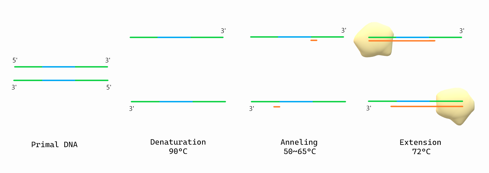
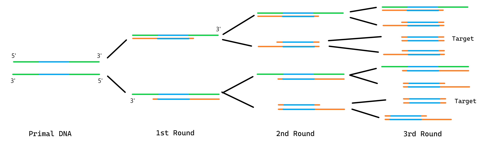
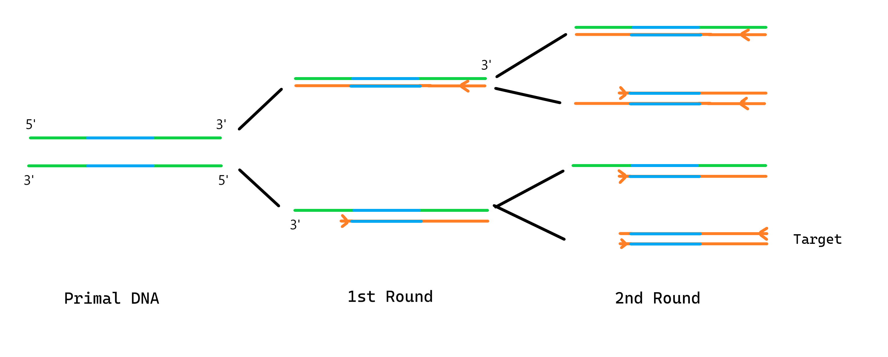
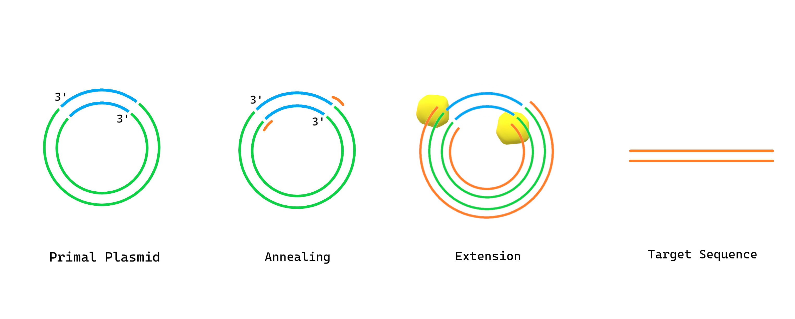
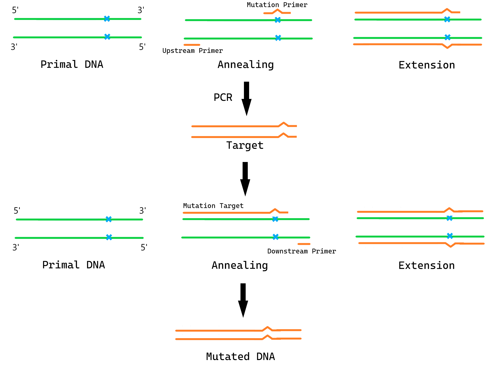

## 前言

PCR 技术是一种以 DNA 半保留复制为基本原理，在短时间内对目的基因的碱基序列进行大量扩增的技术。两种引物分别结合在目的基因的两侧，经过二到三轮循环，即可产生目的基因序列。由于它扩增高效、自动化水平高，它被广泛应用于遗传学研究中。

## PCR 基本知识

PCR 的前期准备需要以下原料/物质：

1. 缓冲液（含 $\ce{Mg^2+}$，用以激活 DNA 聚合酶）
2. 四种脱氧核苷酸（实际上为四种脱氧核糖核苷三磷酸：dATP dTTP dGTP dCTP，类比 ATP，三磷酸中的高能磷酸键可水解供能）
3. 两种引物
4. 耐高温的 DNA 聚合酶（通常为 TaqDNA 聚合酶，从水生栖热菌中分离得到）
5. DNA 模板链

这里最重要的是引物的设计，引物是一种能与 DNA 双链结合的短单链核酸，长度在 20-30 碱基对。因为 DNA 聚合酶只能从 **DNA 片段**的 ${3^\prime}$ 端开始连接脱氧核苷酸，因而就需要人工设计一个片段，让它与 DNA 链结合，从而让聚合酶正常复制出完整的链。

PCR 分为**变性、复性（也称退火）、延伸**三步。首先，在 ${90^\circ C}$ 的高温条件下处理 DNA 分子，使双链间的氢键断开；接着将温度重新降至 ${50^\circ C}$ 左右，让预先设计好的两种引物与 DNA 双链分别结合；最后重新升温至 ${72^\circ C}$ 左右，在保证引物不脱离双链的情况下，让耐高温的 DNA 聚合酶（TaqDNA 聚合酶）将游离的脱氧核苷酸结合到引物片段的 $3^\prime$ 端（羟基端）并继续结合直到完成双链的复制。如下图：

我们发现，PCR 复性时，引物的结合位点总是更靠近模板链的 ${3^\prime}$ 端。这是因为 DNA 聚合酶复制时子链的延伸方向是 ${5^\prime}\rightarrow3^\prime$ 端。又因为 DNA 双链是反向平行的，因此引物的 ${3^\prime}$ 端会更接近目的基因的一段，延伸时就可以将目的基因复制出来。如此便是 PCR 的三大基本步骤。

## PCR 中的数量关系

我们在必修二中学过，DNA 半保留复制得到子代 DNA 分子的个数是呈指数级增长的（单个 DNA 经 $n$ 代复制后得到 ${2^n}$ 个 DNA 分子）。这是因为每次 DNA 复制后的产物都可作为下一轮复制的模板。

一般地，如果两个引物均未结合在 DNA 两端，那么至少经过三轮循环，才会产生完整的目的基因。如下图：

我们根据分子两条链的相对长短，将扩增产物分为三类——中长链、短中链和短短链，其中短短链为目的基因。不难发现，中长链只会来源于 DNA 两条模板链，因而总数恒定为 ${2}$；多推几个循环可以发现中长链和短中链的总数为 ${2n}$，那么短中链的总数为 ${2n-2}$；减去前两种可得目的基因（短短链）的总数为 ${2^n-2n}$。常规 PCR 会进行约 ${30}$ 个循环，也就是说在理想情况下，PCR 最终产物将有 ${99.9999944\%}$ 为目的基因。

再来看引物，发现除了原 DNA 链以外的链都是由引物扩增而来，因此会消耗共 ${2^{n+1}-2}$ 个引物分子，均分到每种引物就是 ${2^n-1}$ 条。

那如果有一种引物结合在 DNA 链的端位呢？如下图：

此时仅需经历两轮 PCR 即可得目的基因。如果两种引物均结合在端位，模型退化成 DNA  的半保留复制，实际操作没有意义，故舍去不谈。

## 反向 PCR 技术

利用质粒构建表达载体后，我们有时并不确定目的基因的插入位点甚至是方向，这种不确定性在仅用同种限制酶切割质粒、以及质粒上存在多个限制酶切位点时特为尤甚。此时我们就需要获得目的基因两侧的碱基序列，就可通过序列比对来快速确定目的基因的具体插入位置。

反向 PCR 主要在环状 DNA 上进行，因为环形 DNA 意味着原本不相连的两段外序列如今连接在一起，那么就可以用 PCR 的方式一次性扩增出该片段。基本思路与普通 PCR 很相似，唯一不同的是，此时外序列变为目的基因，那么设计的引物就应该结合在外序列的 ${3}^\prime$ 端，即原目的基因的 ${5^\prime}$ 端。余下的内容就是普通 PCR 的范畴了，如下图：

## 大引物 PCR 技术

在蛋白质工程中，经常涉及到的一个操作是将某种氨基酸对应的 DNA 编码转换成另一种氨基酸的编码。就需要我们在保证其他碱基顺序和种类不变的情况下，定点突变目的位点的若干碱基，此时便可以使用大引物 PCR 来获得定点突变的 DNA。

开始前，我们需要准备常规上下游引物，它们将分别结合在 DNA 模板链的端位，以及一个在对应位点有过修改的突变引物。首先让上游引物与突变引物结合，进行普通 PCR，有了突变位点的影响，最终扩增出的目的基因在指定位点是有目标突变的。但是产物并非是全部的 DNA 序列（短短链），我们还需要再进行一轮 PCR，用到下游引物和突变引物，即可扩增出完整的定点突变基因。基本思路如下图：

