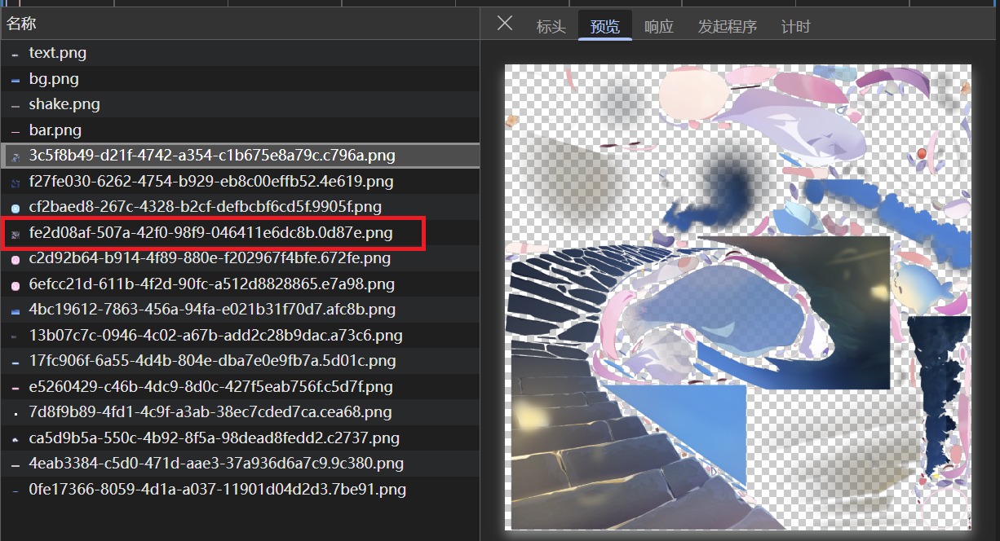
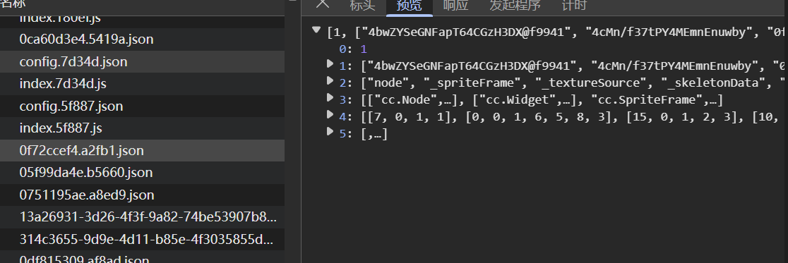
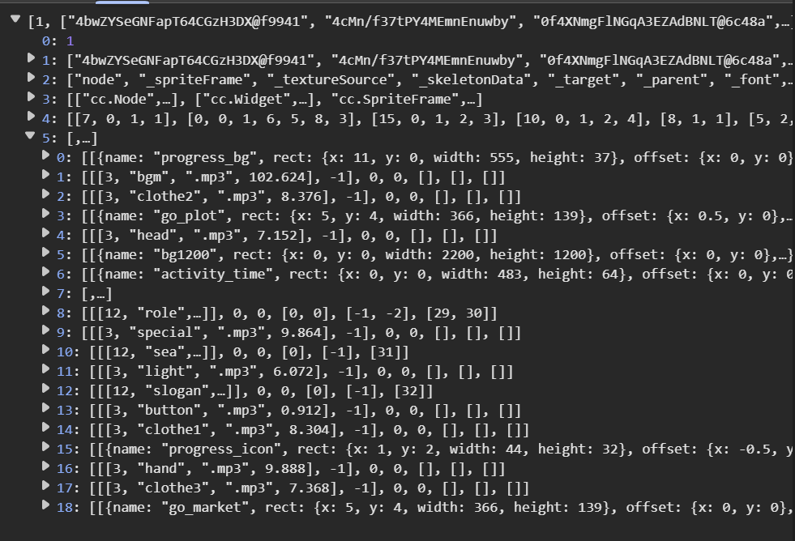
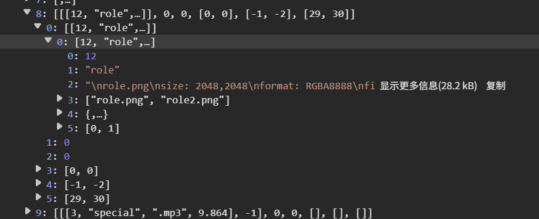

> [!WARNING]
> 本文章仅做学习参考用，严禁将所得模型用于商业用途。<b>本文并非破解，所有图像资源解释权均归 Yostar 所有</b> 

## 为什么会有这篇文章

之前心血来潮做了一个 BA 回忆大厅的播放器 BA-Memory：

[BA Memory - Personal adaptation and online simulator for Memory Lobbies in BlueArchive](https://github.com/JustPureH2O/BA-Memory)

它主要是用来在线播放解包出的回忆大厅 `.skel` 格式文件。某一天我冲浪时突然发现 BA 国服的新 H5 活动，感觉中秋款星野还是太戳人了，上网搜索一圈好像也没有现成的已经提取好的模型文件，于是我决定自己去提取。

## 获取 H5 活动 URL

这个活动网页似乎只在 APP 内有入口，搜索引擎应该没有收录。从开发的角度来说，这样设计可以一定程度上避免浏览器窗口比例不同带来的界面布局问题。但是这样会对提取带来麻烦，因为游戏内浏览器并不能用我们喜闻乐见的 F12 开发者模式，我们首先就需要得到网页活动的 URL 地址。

一般来说，断网之后再点击活动入口，弹出的内部浏览器组件就会因为没有网络连接而输出错误信息。这些错误信息一般都是“无法访问某某 URL 地址”。通过此法，我们顺利找到了 URL 地址 `https://bluearchive-cn.com/webview/midautumn2025/`。插一句嘴，尽管活动时间写的是 10 月 16 日结束，但是截至完稿（11 月 2 日）该网站都还能正常进入，~~不知道里面的小游戏还能不能玩~~。

## 截获请求 提取文件

打开 F12，切到“网络”选项卡，开始录制网络请求并刷新界面。在截获到的所有请求中，我们首先能大致辨别出的元素就是背景贴图，因为它们并没有做加密，而且很容易就看出有星野的衣服贴图。最终我们初步锁定星野所在的模型贴图，是两个 2048×2048 的贴图（红框标出的是另一张贴图）。

我们先把贴图下载了，保存好。相应的动画文件也应该不远，我们可以搜寻得到若干 `json` 文件，其一如下：

事实上在后续的探索中，我们可以发现这就是我们需要的文件。我们展开第五项，可以得到下图结构：

根据名称可以大致猜出每一项的内容，其中 `role`（角色）、`sea`（大海）和 `slogan`（标语）是我们特别要关注的。先看 `role` 这一项，根据名称，它很可能就是星野的模型所在地。继续深入：

如果你熟悉 Spine 动画的 `atlas` 图像集文件格式，你会发现下标为 2 的项出现了这一格式。这证明我们找对方向了。首先将它保存为 `role.atlas` 文件。

打开下标为 4 的 项，内容显然是 `json` 格式。如果你又对 Spine 动画的 `json` 导出格式比较熟悉，那么可以立马判断出这就是编码动画的文件。

一般来讲，BA 的回忆大厅使用的是二进制导出格式，即 `skel`，这样可以节约存储空间，但牺牲了文件可读性；而 `json` 格式则相反，它的体积更大，但是可读。网页 H5 使用的就是后者，甚至没做混淆/加密。因此我们将它另存为 `role.json`，连同章首找到的两个贴图文件一起，分别另存为 `role.png` 和 `role2.png`，并与 `role.atlas`、`role.json` 保存在同一目录下。

如果你想本地实时预览模型，建议使用 Spine 官方提供的[模型查看器 Skeleton Viewer](https://zh.esotericsoftware.com/spine-skeleton-viewer)（本模型对应查看器 3.8.99 版本）。如果你发现贴图有问题，那么请试着将两个贴图文件的文件名互换，注意一定要开启“预乘 Alpha”（Premultiplied）选项。至此我们便完成了模型的提取工作。
