> [!TODO]
> 鉴于本文存在个人打印需求，本文精简版本（不含前言部分）将择日以 PDF 格式附在文首和文末

最新更新：2026.3.8（“双曲线”章节新增“共中点定理”、“焦点三角形相关”新增内切圆半径取值范围的证明）

## 前言

做这篇文章最初的缘由，似乎也早已忘却了，大抵是期中时拍拍脑子生出的主意，然终竟无法再考究了……然而既已入年，我想自己许是有些寂寞而无所事事了。恰逢 Lucas 君邀我做一篇圆锥曲线的文章，他仿佛有点谑我的意思，欲以此指代方才过去的令人悲哀的数学考题，我举起手机只是说：

“假如一道圆锥曲线填空压轴，它是没有常数且万难算出的，考场上有许多没背二级结论的高中生，见到就跳过了，然而是舍小保大，并不感到挂科的悲哀。现在你教他们背二级结论，说动了想冲高分的几人，使这不幸的少数者来受知晓结论而仍解不出的可能挂科的苦楚，你倒以为对得起他们么？”

“然而几个人既然背了，你不能说决没有解出这个题的希望。”

是的，我虽然自有我的确信，然而说到希望，却是不能抹杀的。因为希望是在于将来，决不能以我之必无的证明，来折服了他之所谓可有，于是我终于答应他也做圆锥曲线的文章了。

<i>二零二五年一月十七日，记于成都</i> 

初版完稿之后，我托 T 先生将网页影印出来。于是每逢覆习圆锥曲线的章节，我便很受益于这装订整齐的纸版网页——大多是当作解题的参考、或是在邻桌面前炫耀一番，于是兴味既已起来，以至于下来的讲评一概是专注的。某日，T 先生又复习到这章，照例布置几道习题，我便反射似的去检我的资料。然而翻来覆去几道，也终于未见任何形似“蒙日圆相关三角形面积最值”的条目了。恰逢邻桌探头，豫备找我要资料钞了：

“你的资料，可是写了这些？”

“没有……后面将要讲的‘坎迪定理’也是没有的……”

“那你这些还有啥用？”

信然，情况乃不同于先前，而且推我到达颇为尴尬的境地。这“尴尬”倒并非全在于邻桌的“有啥用”之类的质问，结论搜罗不尽的怅惘，也是有的。这又使我忆起启蒙时所听闻的“纪昌学射”的故事来——能遇见资料之所未有的结论，大抵是我自己在精进罢！于是便于邻桌商讨豫备补录的结论，而且誓言邻桌终于将要补这圆锥曲线的文章了。

<i>二零二五年十一月二日，于成都寓所补录文章时记</i> 

## 切线方程 & 切点弦方程

> [!WARNING]
> 该内容为后文部分二级结论证明过程中直接运用的前置结论，恳请读者首先阅读此章，了解切线方程和切点弦方程的求法和相关证明

切线方程是圆锥曲线中十分常用的附属结论，尽管它与圆锥曲线没有直接关系，但是它在设直线，尤其是证明蒙日圆、阿基米德三角形的相关结论时候有大用。可惜的是，该结论并不属于数学教材中推导并证明的定理，因此原则上**不能在考场上不加证明地使用**。本章将对这两类方程的求法进行简要介绍和推导。

切线/切点弦方程的求法几乎相同，可以用“均分次数，均分系数”八个字概括。例如，我们要求椭圆/双曲线 $E:\frac{x^2}{a^2}\pm\frac{y^2}{b^2}=1$ 在 $P(m,n)$ 的切线方程，只需遵循如下步骤：

1. 均分次数：将 $x^2$ 项平分为两个一次项，其中一个一次项替换为横坐标 $m$，$y^2$ 项同理。其他不变。

做完后可以得到切线方程 $l:\frac{mx}{a^2}+\frac{ny}{b^2}=1$。

如果是抛物线 $y^2=2px$ 呢？此时就需要齐上阵了，步骤如下：

1. 均分次数：同上，将 $y^2$ 替换成 $ny$。保持一次项和常数项（若有）不变。
2. 均分系数：将一次项 $2px$ 的系数平分，得到 $px+px$，其中一个 $x$ 替换为横坐标。

做完后可得切线方程 $l:ny=px+pm$。切点弦方程也是如此求法，一模一样。

### 切线方程

为什么上面讲到的八字真言会有效呢？接下来我们来证明切线方程。

**评析**：可以有多种方法，其中一种是对圆锥曲线（隐函数）求导并代入得到切线方程；另外一种就是相当普通的解析几何方法。我们着重介绍后者，因为你可以毫无顾忌地把它呈现在你的解题过程中。

**证明**：

设切点 $P(m,n)$。

现证椭圆的情况，双曲线同理（为节省篇幅不给出证明），设椭圆方程 $E:\frac{x^2}{a^2}+\frac{y^2}{b^2}=1$，那么有 $\frac{m^2}{a^2}+\frac{n^2}{b^2}=1$。

设切线 $l:y-n=k(x-m)$，化简得 $y=kx-mk+n$，与椭圆方程联立：

$$
\begin{cases}
y=kx-mk+n
\\\frac{x^2}{a^2}+\frac{y^2}{b^2}=1
\end{cases}
$$

得：

$$
\begin{aligned}
\\b^2x^2+a^2(k^2x^2+m^2k^2+n^2-2mk^2x+2nkx-2mnk)-a^2b^2&=0
\\b^2x^2+a^2k^2x^2+a^2m^2k^2+a^2n^2-2ma^2k^2x+2a^2nkx-2a^2mnk-a^2b^2&= 0
\\(b^2+a^2k^2)x^2+(2a^2nk-2ma^2k^2)x+a^2m^2k^2+a^2n^2-2a^2mnk-a^2b^2&=0
\\\Delta&=0
\\(2a^2nk-2ma^2k^2)^2-4(b^2+a^2k^2)(a^2m^2k^2+a^2n^2-2a^2mnk-a^2b^2)&=0
\\\cancel{4a^4n^2k^2}+\cancel{4m^2a^4k^4}-\cancel{8mna^4k^3}-4a^2b^2m^2k^2-4a^2b^2n^2+8a^2b^2mnk+4a^2b^4-\cancel{4m^2a^4k^4}-\cancel{4a^4n^2k^2}+\cancel{8a^4mnk^3}+4a^4b^2k^2&=0
\\-4a^2b^2m^2k^2-4a^2b^2n^2+8a^2b^2mnk+4a^2b^4+4a^4b^2k^2&=0
\\-4m^2k^2-4n^2+8mnk+4b^2+4a^2k^2&=0
\\-m^2k^2-n^2+2mnk+b^2+a^2k^2&=0
\\(a^2-m^2)k^2+2mnk+b^2-n^2&=0
\\(a^2-m^2)k^2+2mnk+\frac{a^2n^2}{a^2-m^2}-n^2&=0
\\(a^2-m^2)k^2+2mnk+\frac{m^2n^2}{a^2-m^2}&=0
\\\frac{a^2n^2}{b^2}k^2+2mnk+\frac{b^2m^2}{a^2}&=0
\\\left(\frac{an}{b}k+\frac{bm}{a}\right)^2&=0
\\k&=-\frac{b^2m}{a^2n}
\end{aligned}
$$

代入点 $P(m,n)$ 反解得切线方程 $l:y-n=-\frac{b^2m}{a^2n}(x-m)$，整理得 $l:\frac{m}{a^2}x+\frac{n}{b^2}y=1$。

接下来证明抛物线的情况，设抛物线方程 $C:y^2=2px$，代入切点有 $n^2=2pm$。

仍然设切线 $l:y-n=k(x-m)$，化简得 $y=kx-mk+n$，与抛物线方程联立：

$$
\begin{cases}
y=kx-mk+n
\\y^2=2px
\end{cases}
$$

得：

$$
\begin{aligned}
k^2x^2+m^2k^2+n^2-2mk^2x+2nkx-2mnk&=2px
\\k^2x^2+(2nk+2mk^2-2p)x+m^2k^2+n^2-2mnk&=0
\\\Delta&=0
\\(2nk+2mk^2-2p)^2-4k^2(m^2k^2+n^2-2mnk)&=0
\\\cancel{4n^2k^2}+\cancel{4m^2k^4}+4p^2+\cancel{8mnk^3}-8pnk-8pmk^2-\cancel{4m^2k^4}-\cancel{4n^2k^2}+\cancel{8mnk^3}&=0
\\4p^2-8pnk-8pmk^2&=0
\\p^2-2pnk-n^2k^2&=0
\\(nk-p)^2&=0
\\k&=\frac{p}{n}
\end{aligned}
$$

代入点 $P(m,n)$，反解得切线方程 $l:y-n=\frac{p}{n}(x-m)$，整理得 $l:ny=px+pm$。

证毕。

**拓展变形**：

在本节证明中，我们反复运用圆锥曲线方程找到 $a^2$ 与 $b^2$、$m^2$ 与 $n^2$ 的等量关系，并且多次代换消去变量或得到易于化简的形式。该思想在圆锥曲线的诸多计算中均有体现。

**微拓展——隐函数求导法求解切线方程**

高中所学的求导方法均是对形如 $y=\dots$ 的函数求导，但是对于圆锥曲线，情况就不一样了。圆锥曲线方程中出现了 $y^2$ 项（根据函数定义，它甚至不能被称作函数，只能称作方程），初等的求导方法没有涉及。此时就需要利用隐函数相关知识，对圆锥曲线方程进行求导操作。

例如有椭圆方程 $E:\frac{x^2}{9}+\frac{y^2}{4}=1$，我们想求出方程的极大值（即上/下顶点），该怎么办呢？

椭圆方程是一个隐函数，对其求导。简单来讲分如下几步：

1. 按照标准求导法则，对每一项按照高中所学的求导法则计算。此时 $E_1:\frac{2x}{9}+\frac{2y}{4}=0$。
2. （这是隐函数求导的关键一步）在所有 $y$ 项后再乘上 $y^\prime$，$y^\prime$ 即为方程的导数。此时 $E^\prime:\frac{2x}{9}+\frac{2yy^\prime}{4}=0$。
3. 移项解出 $y^\prime$。此时 $y^\prime=-\frac{4x}{9y}$。

得到了导数，令 $y^\prime=0$，解得 $x=0$，再代入椭圆方程解得 $y=\pm2$，取舍可得极（最）大值为 ${2}$。

再如给定的抛物线方程 $C:y^2=4x$，要求它在点 $(1,2)$ 的切线方程。隐函数求导得 $2yy^\prime=4$，解得 $y^\prime=\frac{2}{y}$，可得切线斜率 $k=1$，切线方程为 $y=x+1$。代入本节所讲的切线方程验证，答案同样是直线 $y=x+1$。

如果并非标准（中心不一定在原点、不一定关于坐标轴对称）的椭圆方程怎么办？假设非标准的方程是 $E:\frac{x^2}{4}+3xy+\frac{y^2}{8}-8=0$（经过一定旋转的双曲线）。我要求过该方程上一点 $(0,8)$ 的切线方程，那么隐函数求导：

$$
\begin{aligned}
E^\prime:\frac{x}{2}+3y+3xy^\prime+\frac{yy^\prime}{4}&=0
\\y^\prime&=-\dfrac{\frac{x}{2}+3y}{\frac{y}{4}+3x}
\end{aligned}
$$

代入点 $(0,8)$，可得 $k=-12$，切线方程 $l:y=-12x+8$。本推导中我们需要掌握 $xy$ 项的求导方法，利用导数乘法法则（前导后不导，后导前不导），得到 $(xy)^\prime=1y+xy^\prime$。我们又可以总结得到：对 $x$ 求导变常数，对 $y$ 求导变 $y^\prime$。

隐函数相关知识在后面的新定义曲线的极值计算有大用。

### 切点弦方程

切点弦方程的计算方法与切线方程的计算方法一模一样，它们之间有什么奇妙的联系？

**评析**：证明需要利用同构方程的思想。对初识者来讲可能稍难理解。

**证明**：

设曲线外一点 $P(x_0,y_0)$，引圆锥曲线的两条切线，切点为 $A(x_1,y_1),B(x_2,y_2)$。

以椭圆为例，可得 $AP:\frac{x_1}{a^2}x+\frac{y_1}{b^2}y=1,BP:\frac{x_2}{a^2}x+\frac{y^2}{b^2}y=1$。它们的交点为 $P(x_0,y_0)$，代入也成立，二直线方程变形为：

$$
\begin{aligned}
AP:\frac{x_0x_1}{a^2}+\frac{y_0y_1}{b^2}=1
\\BP:\frac{x_0x_2}{a^2}+\frac{y_0y_2}{b^2}=1
\end{aligned}
$$

将 $a,b,x_0,y_0$ 看做常量，它们都满足同一个方程 $f(X,Y)=\frac{x_0}{a^2}X+\frac{y_0}{b^2}Y=1$。所以 $A,B\in f(X,Y)$，而 $f(X,Y)$ 为直线方程，$AB$ 又是切点弦，于是切点弦方程就是 $AB:\frac{x_0}{a^2}x+\frac{y_0}{b^2}=1$。

证毕。

## 椭圆 基础二级结论

> 椭圆定义（第一定义）：平面内一动点到两定点的距离之和为定值，该动点轨迹是以该定点为焦点的椭圆。
> 
> 第二定义：平面内一动点到一个定点（焦点）与到一条定直线（准线）之比为一个常数（离心率）时，该动点轨迹为椭圆。
> 
> 第三定义：平面内一动点到两定点的直线斜率之积为常数 $-\frac{b^2}{a^2}$，该动点的轨迹是以该定点为长轴两端点（不含）的椭圆。
> 
> 基本特征量（本章证明过程中如非特殊说明，所出现的字母量意义均与以下列表相同）：
> 
> 1. 长半轴：$a$，短半轴：$b$，半焦距：$c$，离心率：$e=\frac{c}{a}\in(0,1)$
> 2. 准线横/纵坐标绝对值：$\frac{a^2}{c}$
> 3. 焦准距（焦点到准线距离）：$p=\frac{a^2}{c}-c$

若无特殊说明，椭圆标准方程 $E: \frac{x^2}{a^2}+\frac{y^2}{b^2}=1$ 均满足 $a>b>0$，焦点在 $x$ 轴上。且若无特殊指明，“椭圆 $E$”均指上述的椭圆 $E: \frac{x^2}{a^2}+\frac{y^2}{b^2}=1$。

### 通径

> 在椭圆 $E$ 中，与焦点所在轴垂直的焦点弦被椭圆截得线段的长称作其通径。椭圆的通径长 $d=\frac{2b^2}{a}$。

**评析**：直接将横坐标 $\pm c$ 代入即可解得纵坐标，通径长为纵坐标绝对值的二倍。

**证明**：

横坐标 $c$ 代入椭圆解析式：

$$
\frac{c^2}{a^2}+\frac{y^2}{b^2}=1
$$

得到 $y^2=b^2-b^2e^2$。

因为在椭圆中有 $a^2=b^2+c^2$，因此 $c^2=a^2-b^2$，椭圆离心率还可以表示成 $e=\frac{c}{a}=\sqrt{\frac{c^2}{a^2}}=\sqrt{\frac{a^2-b^2}{a^2}}=\sqrt{1-\frac{b^2}{a^2}}$。代入得：

$$
\begin{aligned}
y^2&=b^2-e^2b^2
\\&=b^2-(1-\frac{b^2}{a^2})b^2
\\&=\frac{b^4}{a^2}
\\y&=\pm\frac{b^2}{a}
\end{aligned}
$$

此时 $d=2|y|=\frac{2b^2}{a}$。

证毕。

### 圆周定理

> 在椭圆 $E$ 中，$A,B$ 是椭圆上关于原点对称的两点，$M$ 是椭圆上异于 $A,B$ 的一点。那么直线 $AM,BM$ 的斜率之积为 $-\frac{b^2}{a^2}$。

**评析**：也不需要什么特殊的技巧，就是设点硬算。这个结论是必背的经典二级结论之一。

**证明**：

设 $A(x_1,y_1)~B(-x_1,-y_1)~M(x_2,y_2)$。那么两直线斜率之积可以表示为 $k_{AM}k_{BM}$，即：

$$
\begin{aligned}
k_{AM}\cdot k_{BM}&=\frac{y_2-y_1}{x_2-x_1}\times\frac{y_2+y_1}{x_2+x_1}
\\&=\frac{y_2^2-y_1^2}{x_2^2-x_1^2}
\end{aligned}
$$

三点都在椭圆上，代入椭圆解析式得关系式：

$$
\begin{cases}
\dfrac{x_1^2}{a^2}+\dfrac{y_1^2}{b^2}=1
\\\qquad
\\\dfrac{x_2^2}{a^2}+\dfrac{y_2^2}{b^2}=1
\end{cases}\rightarrow\begin{cases}
y_1^2=b^2-\dfrac{b^2x_1^2}{a^2}
\\\qquad
\\y_2^2=b^2-\dfrac{b^2x_2^2}{a^2}
\end{cases}
$$

将 $y_1^2$ 和 $y_2^2$ 用 $x_1^2,x_2^2$ 表示出来：

$$
\begin{aligned}
&=\dfrac{\frac{b^2}{a^2}(x_1^2-x_2^2)}{x_2^2-x_1^2}
\\&=-\frac{b^2}{a^2}
\end{aligned}
$$

证毕。

**拓展变形**：

我们默认椭圆的焦点位于 $x$ 轴，那万一焦点在 $y$ 轴上呢？首先我们需要保证较大的分母为 $a$，较小的为 $b$，例如 $\frac{y^2}{9}+\frac{x^2}{4}=1$，此时 $a^2=9,b^2=4$，现在的两直线斜率之积为 $-\frac{9}{4}$，即 $-\frac{a^2}{b^2}$，分子分母调换了！做题时一定要注意，证明方法同上。

当其中一个定点恰好位于长轴端点时，得到椭圆第三定义。

### 广义垂径定理/中点弦公式（解析法）

> 在椭圆 $E$ 中，$A,B$ 为椭圆上两点，$M$ 为弦 $AB$ 的中点，那么直线 $OM$ 与直线 $AB$ 的斜率之积为 $-\frac{b^2}{a^2}$。

**评析**：处理中点的方法一共有两个——常规联立法和点差法。此处我们使用第一种（点差法稍后介绍），用韦达定理可以很轻松的表示出中点的坐标；同时设出直线 $AB$ 代表我们可以只用一个 $k$ 表示其斜率，由于 $OM$ 过原点，表示它的斜率也是容易的。那我们就开始吧。

**证明**：

设直线 $AB:y=kx+m$。斜率不存在时无意义，故斜率一定存在。联立方程：

$$
\begin{cases}
y=kx+m
\\\frac{x^2}{a^2}+\frac{y^2}{b^2}=1
\end{cases}
$$

得：

$$
\begin{aligned}
b^2x^2+a^2(k^2x^2+2mkx+m^2)-a^2b^2&=0
\\(b^2+a^2k^2)x^2+2a^2mkx+a^2m^2-a^2b^2&=0
\end{aligned}
$$

根据韦达定理得：

$$
x_1+x_2=-\frac{2a^2mk}{b^2+a^2k^2},x_1x_2=\frac{a^2m^2-a^2b^2}{b^2+a^2k^2}
$$

因此 $M\left(-\dfrac{a^2mk}{b^2+a^2k^2},\dfrac{b^2m}{b^2+a^2k^2}\right)$。得到斜率乘积为 $k\cdot\left(-\dfrac{b^2m}{a^2mk}\right)=-k\cdot\dfrac{b^2}{a^2k}=-\dfrac{b^2}{a^2}$。

证毕。

**拓展变形**：易错点与上一个结论相同，焦点所在坐标轴改变后，乘积会从原先的 $-\frac{b^2}{a^2}$ 变成 $-\frac{a^2}{b^2}$。

### 广义垂径定理/中点弦公式（点差法）

结论同上。

**评析**：注意到圆锥曲线的解析式中存在平方项 $x^2,y^2$，代入两点坐标后联立，作差，利用平方差公式并代换中点坐标也是一个十分方便的方法。

**证明**：

设中点弦两端点 $A(x_1,y_1),B(x_2,y_2)$ 及其中点 $M(x_0,y_0)$。根据中点定义有 $x_0=\frac{x_1+x_2}{2},y_0=\frac{y_1+y_2}{2}$，联立两端点：

$$
\begin{cases}
\frac{x_1^2}{a^2}+\frac{y_1^2}{b^2}=1
\\\frac{x_2^2}{a^2}+\frac{y_2^2}{b^2}=1
\end{cases}
$$

两式相减得：

$$
\begin{aligned}
\frac{x_1^2-x_2^2}{a^2}+\frac{y_1^2-y_2^2}{b^2}&=0
\\\frac{(x_1+x_2)(x_1-x_2)}{a^2}+\frac{(y_1+y_2)(y_1-y_2)}{b^2}&=0
\\\frac{2x_0(x_1-x_2)}{a^2}+\frac{2y_0(y_1-y_2)}{b^2}&=0
\end{aligned}
$$

可得：

$$
\begin{aligned}
\\\frac{y_0}{x_0}&=-\frac{b^2(x_1-x_2)}{a^2(y_1-y_2)}
\\\frac{y_0}{x_0}\times\frac{y_1-y_2}{x_1-x_2}&=-\frac{b^2}{a^2}
\\k_{OM}\cdot k_{AB}&=-\frac{b^2}{a^2}
\end{aligned}
$$

得证。

**拓展变形**：

事实上，点差法可被广泛运用于大部分中点问题。通过平方差公式的处理，原式可化为有关中点坐标、弦斜率和圆锥曲线固有参数的式子，从而发现三者的联系。

如果是竖椭圆，那么乘积变为 $-\frac{a^2}{b^2}$。可总结得到乘积无论如何都小于 ${1}$。

### 焦半径公式（点坐标版）

> 令 $F_1,F_2$ 为椭圆 $E$ 的左右焦点，$P(x_0,y_0)$ 为椭圆上一点，那么 $|PF_1|=a+ex_0,|PF_2|=a-ex_0$。其中 $e=\frac{c}{a}$，即椭圆的离心率。

**评析**：这个结论其实就是椭圆第二定义的变形式，不信你看。

**证明**：

先证 $|PF_1|=a+ex_0$。对于 $F_1$ 来说，对应的准线为直线 $x=-\frac{a^2}{c}$。根据椭圆第二定义有：

$$
\begin{aligned}
\dfrac{|PF_1|}{x_0+\frac{a^2}{c}}&=e
\\\dfrac{|PF_1|}{x_0+\frac{a}{e}}&=e
\\|PF_1|&=ex_0+a
\end{aligned}
$$

再证 $|PF_2|=a-ex_0$。其实根据椭圆第一定义 $|PF_1|+|PF_2|=2a$ 即可推出它，但是我们继续用第二定义推导。此时对应的准线是直线 $x=\frac{a^2}{c}$：

$$
\begin{aligned}
\dfrac{|PF_2|}{\frac{a}{e}-x_0}&=e
\\|PF_2|&=a-ex_0
\end{aligned}
$$

证毕。

**拓展变形**：

焦点在 $y$ 轴上时，结论变为 $|PF_1|=a+ey_0,|PF_2|=a-ey_0$。

该结论适用性较差，建议背诵并掌握焦半径公式（斜率版）。

### 焦半径公式（斜率版）

> 设焦点弦 $l:x=ky\pm c$ 与椭圆交于 $A,B$ 两点，焦点弦倾斜角为 $\theta$，有焦半径公式 $AF=\frac{ep}{1+e\cos\theta},BF=\frac{ep}{1-e\cos\theta}$，焦点弦长 $AB=\frac{2ep}{1-e^2\cos^2\theta}$。

**评析**：可以从点坐标法的结论出发，用斜率、焦准距相关量表示出公式中 $x_0$，化简即可得到结果。

**证明**：

为稍微节省篇幅，只证其中一边。

由上证明可得 $|AF|=a-ex_0$，现代换 $x_0$。过 $A$ 作 $x$ 轴垂线，垂足为 $C$，如下图：

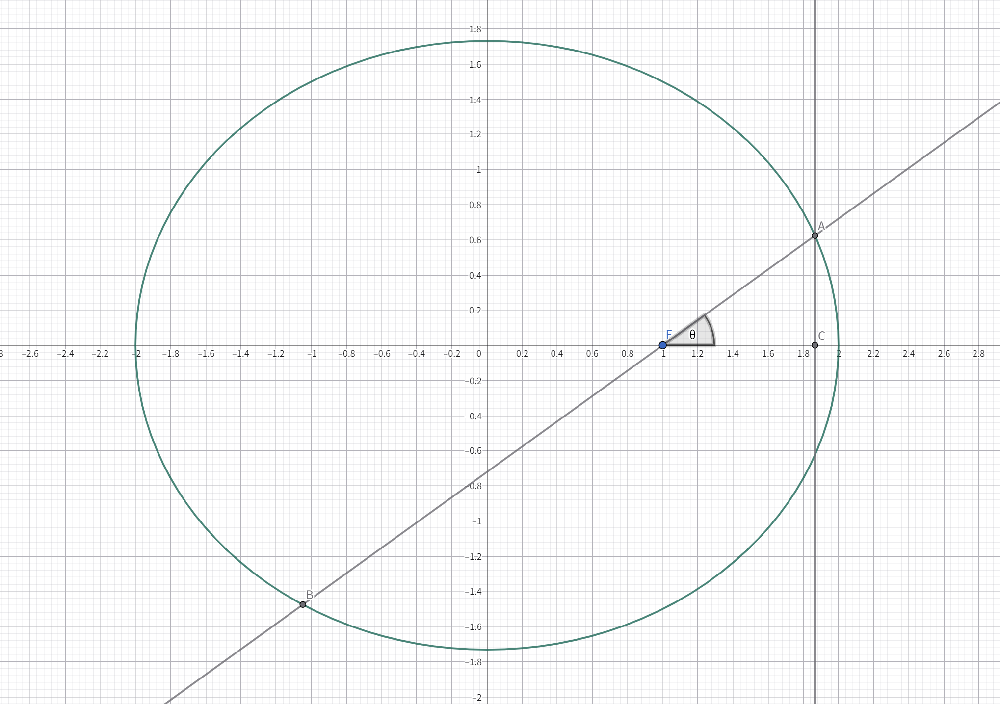

可知 $x_0=c+|AF|\cos\theta$，现有 $|AF|=a-e(c+|AF|\cos\theta)$，进行化简：

$$
\begin{aligned}
|AF|&=a-e(c+|AF|\cos\theta)
\\|AF|&=a-\frac{c^2}{a}-e|AF|\cos\theta
\\(1+e\cos\theta)|AF|&=a-\frac{c^2}{a}
\\|AF|&=\dfrac{a-\frac{c^2}{a}}{1+e\cos\theta}
\\|AF|&=\dfrac{\frac{c}{a}(\frac{a^2}{c}-c)}{1+e\cos\theta}
\\|AF|&=\dfrac{ep}{1-e\cos\theta}
\end{aligned}
$$

另一端同理，二者相加得到焦点弦长公式 $AB=\frac{2ep}{1-e^2\cos^2\theta}$。

证毕。

**拓展变形**：

如何记忆分母是 ${1}+e\cos\theta$ 还是 ${1}-e\cos\theta$ 呢？画出草图，看看焦半径孰长孰短，再选用相应的公式，是一种比较简便的方法。

如果是竖椭圆，那么将公式中 $\cos$ 变为 $\sin$。类比观察可以发现该公式中的 $\theta$ 实则为焦点弦与交点所在直线的锐夹角大小。

如果将焦半径公式做倒数并相加，可以得到另外一个重要结论：$\frac{1}{|AF|}+\frac{1}{|BF|}=\frac{2}{ep}$。

### 焦点三角形相关

> 椭圆的左右焦点 $F_1,F_2$ 与椭圆上一点 $P$ 组成的三角形 $\triangle PF_1F_2$ 称作这个椭圆的焦点三角形。

本节中出现的角 $\theta$ 若无特殊说明均指代 $\angle F_1PF_2$。

#### 取值范围

> 焦点三角形 $\triangle PF_1F_2$ 中，$|PF_1|\in(a-c,a+c),|PF_2|\in(a-c,a+c),|PF_1||PF_2|\leq a^2$。

**评析**：前两个非常好证，他们理论上在 $P$ 与左右端点重合时取到最值，但是此时 $P,F_1,F_2$ 三点共线，因此不是三角形，所以是开区间。对于第三个，乘积的取值范围，则需要基本不等式。

**证明**：

根据基本不等式有：

$$
|PF_1||PF_2|\leq\left(\frac{|PF_1|+|PF_2|}{2}\right)^2=a^2
$$

证毕。

#### 周长

> 焦点三角形 $\triangle PF_1F_2$ 的周长 $C_{\triangle PF_1F_2}=|PF_1|+|PF_2|+|F_1F_2|=2a+2c$。

**评析**：根据椭圆的第一定义来的，$|PF_1|+|PF_2|=2a,|F_1F_2|=2c$。

#### 面积

> 焦点三角形 $\triangle PF_1F_2$ 的面积 $S_{\triangle F_1F_2}=b^2\tan\frac{\theta}{2}$。

**评析**：出现角度和面积，我们需要想到正/余弦定理。根据正弦定理的三角形面积公式 $S=\frac{1}{2}ab\sin\theta$ 以及余弦定理的 $c^2=a^2+b^2-2ab\cos\theta$，我们可以解决大部分与边长和角度有关的圆锥曲线证明/求值问题。

**证明**：

由正弦定理得，$S_{\triangle PF_1F_2}=\frac{1}{2}|PF_1||PF_2|\sin\theta$。

在 $\triangle PF_1F_2$ 中运用余弦定理：$|F_1F_2|^2=4c^2=|PF_1|^2+|PF_2|^2-2|PF_1||PF_2|\cos\theta$，得到 $|PF_1||PF_2|=\dfrac{|PF_1|^2+|PF_2|^2-4c^2}{2\cos\theta}$。

同时根据完全平方公式，$|PF_1|^2+|PF_2|^2=(|PF_1|+|PF_2|)^2-2|PF_1||PF_2|=4a^2-2|PF_1||PF_2|$，代入上式移项解得 $|PF_1||PF_2|=\dfrac{2(a^2-c^2)}{1+\cos\theta}$，根据面积公式可得 $S=\dfrac{(a^2-c^2)\sin\theta}{1+\cos\theta}=\dfrac{b^2\sin\theta}{1+\cos\theta}=b^2\tan\dfrac{\theta}{2}$。

证毕。

**拓展变形**：三角函数的半角公式（附证明）。

——正/余弦半角公式

根据余弦倍角公式的变形式 $\cos2\theta=2\cos^2\theta-1$，将 ${2}\theta$ 换成 $\theta$，$\theta$ 换成 $\frac{\theta}{2}$ 即得 $\cos\theta=2\cos^2\frac{\theta}{2}-1$，$\cos\frac{\theta}{2}=\sqrt{\frac{\cos\theta+1}{2}}$。

同理，对于正弦函数，有 $\cos2\theta=1-2\sin^2\theta\rightarrow\cos\theta=1-2\sin^2\frac{\theta}{2}\rightarrow\sin\frac{\theta}{2}=\sqrt{\frac{1-\cos\theta}{2}}$。

——正切半角公式

由正切函数定义可得 $\tan\frac{\theta}{2}=\dfrac{\sin\frac{\theta}{2}}{\cos\frac{\theta}{2}}$，利用三角函数的升幂，也就是上面导出正余弦半角公式时使用的余弦倍角公式，分子分母同乘 $\cos\frac{\theta}{2}$ 可得：$\tan\frac{\theta}{2}=\dfrac{\sin\frac{\theta}{2}\cos\frac{\theta}{2}}{\cos^2\frac{\theta}{2}}=\dfrac{\frac{1}{2}\sin\theta}{\frac{1}{2}(1+\cos\theta)}=\dfrac{\sin\theta}{\cos\theta+1}$。

因此证明面积公式时出现的 $\frac{\sin\theta}{\cos\theta+1}$ 可以换成 $\tan\frac{\theta}{2}$。三个公式汇总起来就是：

$$
\sin\frac{\theta}{2}=\sqrt{\frac{1-\cos\theta}{2}}\qquad\cos\frac{\theta}{2}=\sqrt{\frac{\cos\theta+1}{2}}\qquad\tan\frac{\theta}{2}=\frac{\sin\theta}{\cos\theta+1}
$$

#### 内切圆

> 焦点三角形 $\triangle PF_1F_2$ 的内切圆半径为 $\frac{c}{\sin\theta}$，已知半径也可求出顶角 $\sin\theta=\frac{c}{R}$。

**评析**：这一条其实也没什么，主要是正弦定理的运用。因为在三角形中 $\frac{a}{\sin A}=\frac{b}{\sin B}=\frac{c}{\sin C}=2R$，其中 $R$ 就是内切圆半径。将 $\theta$ 所对的边 $F_1F_2$ 的长度代入即可证得该结论。

#### 离心率公式

> 令焦点三角形 $\triangle PF_1F_2$ 的底角 $\angle PF_1F_2=\alpha,\angle PF_2F_1=\beta$，那么椭圆的离心率 $e=\frac{\sin(\alpha+\beta)}{sin\alpha+\sin\beta}=\frac{\sin\theta}{\sin\alpha+\sin\beta}$。

**评析**：有角有边，当然考虑正余弦定理。

**证明**：

易知此时 $\theta=\pi-\alpha-\beta$。根据正弦定理有 $\frac{2c}{\sin(\pi-\alpha-\beta)}=\frac{2c}{\sin(\alpha+\beta)}=\frac{|PF_1|}{\sin\beta}=\frac{|PF_2|}{\sin\alpha}$。在椭圆中又有 $|PF_1|+|PF_2|=2a$，那么 $|PF_2|=2a-|PF_1|$。

代入连等式中，得到 $\frac{2c}{\sin(\alpha+\beta)}=\frac{|PF_1|}{\sin\beta}=\frac{2a-|PF_1|}{\sin\alpha}$，根据后两项可以解出 $|PF_1|=\frac{2a\sin\beta}{\sin\alpha+\sin\beta}$，此时代入第二项得到 $\frac{2c}{\sin(\alpha+\beta)}=\frac{2a}{\sin\alpha+\sin\beta}$。

此时 $\frac{c}{a}=e=\frac{\sin(\alpha+\beta)}{\sin\alpha+\sin\beta}=\frac{\sin\theta}{\sin\alpha+\sin\beta}$。

证毕。

### 等角定理

> 椭圆的一条焦点弦交曲线于 $A,B$ 两点，设 $T$ 为椭圆的一条准线与焦点所在坐标轴的交点，那么有斜率 $k_{AT}+k_{BT}=0$。

**证明**：

不妨设 $T\left(\frac{a^2}{c},0\right)$，焦点弦 $l:y=k(x-c)$。联立方程：

$$
\begin{aligned}
b^2x^2+a^2(k^2x^2-2ck^2x+c^2k^2)-a^2b^2&=0
\\(a^2k^2+b^2)x^2-2a^2ck^2x+a^2c^2k^2-a^2b^2&=0
\end{aligned}
$$

韦达定理得：$x_1+x_2=\frac{2a^2ck^2}{a^2k^2+b^2}\qquad x_1x_2=\frac{a^2c^2k^2-a^2b^2}{a^2k^2+b^2}$。

表示斜率：

$$
\begin{aligned}
&\phantom{=}k_1+k_2
\\&=\frac{y_1}{x_1-x_T}+\frac{y_2}{x_2-x_T}
\\&=\frac{kx_1-ck}{x_1-x_T}+\frac{kx_2-ck}{x_2-x_T}
\\&=\frac{2kx_1x_2-(ck+kx_T)(x_1+x_2)+2ckx_T}{x_1x_2-x_T(x_1+x_2)+x_T^2}
\end{aligned}
$$

即证 $2kx_1x_2-(ck+kx_T)(x_1+x_2)+2ckx_T=0$：

$$
\begin{aligned}
&=2kx_1x_2-(ck+kx_T)(x_1+x_2)+2ckx_T
\\&=\frac{2k^3a^2c^2-2a^2b^2k}{a^2k^2+b^2}-\frac{2k^3c^2a^2+2a^4k^3}{a^2k^2+b^2}+2a^2k
\\&=\frac{2k^3a^2c^2-2a^2b^2k-2k^3a^2c^2-2a^4k^3+2a^4k^3+2a^2b^2k}{a^2k^2+b^2}
\\&=0
\end{aligned}
$$

证毕。

### 光学性质

在椭圆章节的最后，我们将用一个物理式的问题来为它作结。事实上，这个结论将在稍后的“蒙日圆”章节中作为几何法证明的前置结论出现。这个性质在生活当中也有广泛的应用，符合高考命题“情景载体串联”的原则。

> 椭圆内部经过椭圆其中一个焦点的光束，在椭圆内表面上的反射光线将经过它的另一个焦点。

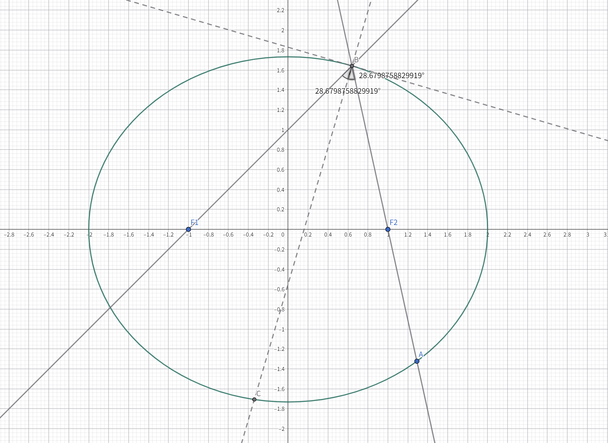

**评析**：反射的基本要求是反射角等于入射角，这指示我们作出椭圆上反射点的法线，这又要求我们作出椭圆在反射点的切线（切线方程），并证明法线是“入射光线”和“反射光线”的角平分线。

**证明**：

设椭圆上的反射点 $P(m,n)$，那么过 $P$ 的切线方程 $l_1:\frac{m}{a^2}x+\frac{n}{b^2}y=1$，整理得 $l:y=-\frac{b^2m}{a^2n}x+\frac{b^2}{n}$。

可得法线斜率 $\tan\theta_n=\frac{a^2n}{b^2m}$。继续算出入射和反射光线斜率为 $\tan\theta_1=\frac{n}{m-c}$ 和 $\tan\theta_2=\frac{n}{m+c}$。欲验证法线为角平分线，即证 $\theta_n=\frac{\theta_1+\theta_2}{2}\rightarrow2\theta_n=\theta_1+\theta_2$。

因为点 $P$ 在椭圆上，有 $\frac{m^2}{a^2}+\frac{n^2}{b^2}=1$，可得 $n^2=b^2-\frac{b^2m^2}{a^2}$。

利用正切的和角公式：

$$
\begin{aligned}
\tan(\theta_1+\theta_2)&=\dfrac{\frac{n}{m-c}+\frac{n}{m+c}}{1-\frac{n^2}{m^2-c^2}}
\\&=\dfrac{\frac{2mn}{m^2-c^2}}{\frac{m^2-c^2-n^2}{m^2-c^2}}
\\&=\dfrac{2mn}{m^2-c^2-n^2}
\\&=\dfrac{2mn}{m^2-a^2+b^2-b^2+\frac{b^2}{a^2}m^2}
\\&=\dfrac{2mn}{(1+\frac{b^2}{a^2})m^2-a^2}
\end{aligned}
$$

同时计算：

$$
\begin{aligned}
\tan2\theta_n&=\dfrac{\frac{2a^2n}{b^2m}}{1-(\frac{a^2n}{b^2m})^2}
\\&=\dfrac{\frac{2a^2n}{b^2m}}{1-\frac{a^4n^2}{b^4m^2}}
\\&=\dfrac{\frac{2a^2n}{b^2m}}{\frac{b^4m^2-a^4n^2}{b^4m^2}}
\\&=\dfrac{2a^2b^2mn}{b^4m^2-a^4n^2}
\\&=\dfrac{2mn}{\frac{b^2}{a^2}m^2-\frac{a^2}{b^2}n^2}
\\&=\dfrac{2mn}{\frac{b^2}{a^2}m^2-a^2+m^2}
\\&=\dfrac{2mn}{(1+\frac{b^2}{a^2})m^2-a^2}
\\&=\tan(\theta_1+\theta_2)
\end{aligned}
$$

证毕。

**拓展变形**：

该结论（包括双曲线光学性质）的推导过程提示我们，当式子中出现双变量，而且这两个变量与圆锥曲线有密切联系（本例中为 $P$ 点横纵坐标满足解析式）时，可以通过圆锥曲线的方程消去其一，从而达到化简的目的。

## 双曲线 基础二级结论

> 双曲线定义（第一定义）：平面内一动点到两定点的距离之差的绝对值为定值，该动点轨迹是以该定点为焦点的双曲线。
> 
> 第二定义：平面内一动点到一个定点（焦点）与到一条定直线（准线）之比为一个常数（离心率）时，该动点轨迹为双曲线。
> 
> 第三定义：平面内一动点到两定点的直线斜率之积为常数 $\frac{b^2}{a^2}$，该动点的轨迹是以该定点为实轴两端点（不含）的双曲线。
> 
> 基本特征量（本章证明过程中如非特殊说明，所出现的字母量意义均与以下列表相同）：
> 
> 1. 实半轴：$a$，虚半轴：$b$，半焦距：$c$，离心率：$e=\frac{c}{a}>1$
> 2. 准线横/纵坐标绝对值：$\frac{a^2}{c}$
> 3. 焦准距（焦点到准线距离）：$p=c-\frac{a^2}{c}$
> 4. 渐近线方程：$y=\pm\frac{b}{a}x$（$a,b$ 分别为双曲线标准方程 $x^2,y^2$ 项的分母的算术平方根）

若无特殊说明，双曲线标准方程 $E: \frac{x^2}{a^2}-\frac{y^2}{b^2}=1$，满足 $a>0,b>0,a\neq b$，焦点在 $x$ 轴上。且若无特殊说明，“双曲线 $E$”均指上述的标准双曲线 $E:\frac{x^2}{a^2}-\frac{y^2}{b^2}=1$。

### 通径

> 在双曲线 $E$ 中，与焦点所在轴垂直的焦点弦被双曲线截得线段的长称作其通径。双曲线的通径长 $d=\frac{2b^2}{a}$。

**评析**：与椭圆证法相同。

**证明**：

将横坐标 $\pm c$ 代入得 $y^2=b^2e^2-b^2$。因为双曲线满足 $c^2=a^2+b^2$，可以推导出 $e=\sqrt{1+\frac{b^2}{a^2}}$。那么 $y^2=\frac{b^4}{a^2}$，得到 $y=\pm\frac{2b^2}{a}$。此时通径长为 $d=2|y|=\frac{2b^2}{a}$。

证毕。

### 圆周定理

> 在双曲线 $E$ 中，$A,B$ 是双曲线上关于原点对称的两点，$M$ 是双曲线上异于 $A,B$ 的一点。那么直线 $AM,BM$ 的斜率之积为 $\frac{b^2}{a^2}$。

**评析**：双曲线有关二级结论的证明思路和椭圆基本相同，这里我们沿用椭圆的证明方法继续硬算。

**证明**：

设 $A(x_1,y_1)~B(-x_1,-y_1)~M(x_2,y_2)$，那么：

$$
\begin{aligned}
k_{AM}\cdot k_{BM}&=\frac{y_2-y_1}{x_2-x_1}\times\frac{y_2+y_1}{x_2+x_1}
\\&=\frac{y_2^2-y_1^2}{x_2^2-x_1^2}
\end{aligned}
$$

三点都在双曲线上，得到：

$$
\begin{cases}
y_1^2=\dfrac{b^2x_1^2}{a^2}-b^2
\\\qquad
\\y_2^2=\dfrac{b^2x_2^2}{a^2}-b^2
\end{cases}
$$

代入得：

$$
\begin{aligned}
&=\dfrac{\frac{b^2}{a^2}(x_2^2-x_1^2)}{x_2^2-x_1^2}
\\&=\frac{b^2}{a^2}
\end{aligned}
$$

证毕。

**拓展变形**：焦点所在坐标轴改变时同样要变成 $\frac{a^2}{b^2}$。

### 广义垂径定理/中点弦公式（解析法）

> 在双曲线 $E$ 中，$A,B$ 为双曲线上两点，$M$ 为弦 $AB$ 的中点，那么直线 $OM$ 与直线 $AB$ 的斜率之积为 $\frac{b^2}{a^2}$。

**评析**：同样使用椭圆的证明方法。

**证明**：

令直线 $AB: y=kx+m$，斜率不存在时无意义，故斜率存在。联立直线和双曲线方程：

$$
\begin{cases}
y=kx+m
\\\frac{x^2}{a^2}-\frac{y^2}{b^2}=1
\end{cases}
$$

得到：$(b^2-a^2k^2)x^2-2a^2mkx-a^2m^2-a^2b^2=0$。韦达定理得 $x_1+x_2=\dfrac{2a^2mk}{b^2-a^2k^2},x_1x_2=-\dfrac{a^2m^2+a^2b^2}{b^2-a^2k^2}$。

得到中点坐标 $M\left(\dfrac{a^2mk}{b^2-a^2k^2},\dfrac{b^2m}{b^2-a^2k^2}\right)$，此时斜率之积表示为：

$$
\begin{aligned}
k_{AB}\cdot k_{OM}&=k\cdot\dfrac{b^2m}{a^2mk}
\\&=k\cdot\dfrac{b^2}{a^2k}
\\&=\frac{b^2}{a^2}
\end{aligned}
$$

证毕。

**拓展变形**：焦点在 $y$ 轴上时对应的乘积是 $\frac{a^2}{b^2}$。

### 广义垂径定理/中点弦公式（点差法）

结论同上。

**评析**：同样使用椭圆的证明方法。

**证明**：

设中点弦两端点 $A(x_1,y_1),B(x_2,y_2)$，中点 $M(x_0,y_0)$。有 $x_0=\frac{x_1+x_2}{2},y_)=\frac{y_1+y_2}{2}$，联立两端点：

$$
\begin{cases}
\frac{x_1^2}{a^2}-\frac{y_1^2}{b^2}=1
\\\frac{x_2^2}{a^2}-\frac{y_2^2}{b^2}=1
\end{cases}
$$

两式相减得：

$$
\begin{aligned}
\frac{x_1^2-x_2^2}{a^2}+\frac{y_2^2-y_1^2}{b^2}&=0
\\\frac{(x_1+x_2)(x_1-x_2)}{a^2}+\frac{(y_2+y_1)(y_2-y_1)}{b^2}&=0
\\\frac{2x_0(x_1-x_2)}{a^2}+\frac{2y_0(y_2-y_1)}{b^2}&=0
\end{aligned}
\\\begin{aligned}
\\\frac{y_0}{x_0}&=-\frac{b^2(x_1-x_2)}{a^2(y_2-y_1)}
\\\frac{y_0}{x_0}\times\frac{y_1-y_2}{x_1-x_2}&=\frac{b^2}{a^2}
\\k_{OM}\cdot k_{AB}&=\frac{b^2}{a^2}
\end{aligned}
$$

得证。

**拓展变形**：

竖双曲线中结论变为 $\frac{b^2}{a^2}$。

### 焦半径公式（横坐标版）

> 令 $F_1,F_2$ 为双曲线 $E$ 的左右焦点，$P(x_0,y_0)$ 为双曲线上一点，$P$ 在右支上时有 $|PF_1|=a+ex_0,|PF_2|=-a+ex_0$；在左支上时有 $|PF_1|=-a-ex_0,|PF_2|=a-ex_0$。

**评析**：双曲线第二定义的变形

**证明**：

当 $P$ 在右支时，根据第二定义，有 $\dfrac{|PF_1|}{\frac{a^2}{c}+x_0}=\dfrac{|PF_1|}{\frac{a}{e}+x_0}=e$，得到 $|PF_1|=a+ex_0$，然后根据双曲线中 $||PF_1|-|PF_2||=2a$ 可得 $|PF_2|=-a+ex_0$。

同理可以证得左支公式。

证毕。

**拓展变形**：

焦点在 $y$ 轴上时要把 $x_0$ 换成 $y_0$。

如何记忆这些公式呢？首先可以先只记住一边，然后利用第一定义，通过焦点弦长差等于 ${2a}$ 可得到另一边；其次，符号可以通过代特殊点（实轴端点最佳）来快速检验。

### 焦半径公式（斜率版）

> 设焦点弦 $AB$，有焦半径公式 $AF=\frac{ep}{e\cos\theta-1},BF=\frac{ep}{e\cos\theta+1}$，焦点弦长 $AB=\frac{2ep}{e^2\cos^2\theta-1}$

**评析**：与证明椭圆焦半径公式相同的办法，从简便的结论入手，将其中的 $x_0$ 用角度 $\theta$ 相关量表示出来。

**证明**：

为稍微节省篇幅，只证两点均在右支的情况的其中一边。

由已知结论，$|AF|=-a+ex_0$。过 $A$ 作 $x$ 轴垂线，垂足为 $H$。如下图：

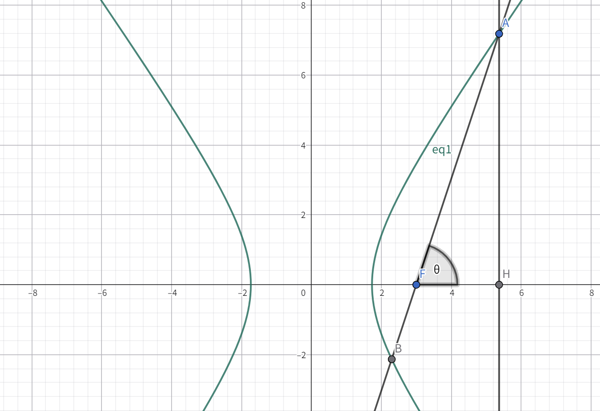

可得 $x_0=c+|AF|\cos\theta$。那么有：

$$
\begin{aligned}
|AF|&=-a+ce+e|AF|\cos\theta
\\|AF|&=-a+\frac{c^2}{a}+e|AF|\cos\theta
\\(1-e\cos\theta)|AF|&=-a+\frac{c^2}{a}
\\|AF|&=\dfrac{-a+\frac{c^2}{a}}{1-e\cos\theta}
\\|AF|&=\dfrac{\frac{c}{a}(\frac{a^2}{c}-c)}{1-e\cos\theta}
\\|AF|&=\dfrac{-ep}{1-e\cos\theta}
\\|AF|&=\dfrac{ep}{e\cos\theta-1}
\end{aligned}
$$

另一边同理可证，二者相加得到焦点弦长公式 $AB=\frac{2ep}{e^2\cos^2\theta-1}$。

证毕。

**拓展变形**：

如果是竖双曲线，那么将公式中 $\cos$ 变为 $\sin$。类比观察可以发现该公式中的 $\theta$ 实则为焦点弦与交点所在直线的锐夹角大小。

与椭圆类似，将焦半径公式取倒数，并相减可得：$\frac{1}{|BF|}+\frac{1}{|AF|}=\frac{2}{ep}$。

### 渐近线相关

> 过原点且在无穷远处与双曲线的距离无限趋近于 ${0}$ 的两条直线叫做这个双曲线的渐近线。焦点在 $x$ 轴上时渐近线的解析式为 $y=\pm\frac{b}{a}x$；若在 $y$ 轴上则为 $y=\pm\frac{a}{b}x$，即 $x=\pm\frac{b}{a}y$。

在高中阶段，双曲线的渐近线方程的证明方式几乎就是取极限值（$x\rightarrow\infty$）求得，这种方法并不严谨，但是在高中课标下，这是学生可能想到的唯一方法。但无需担心，因为考试大概率不考，因此记住结论即可，实在不行就如前文代入极限值检验。

#### 焦点-渐近线距离

> 双曲线的焦点与任意一条渐近线的距离均为 $b$。

**评析**：使用点到直线的距离公式证明。

**证明**：

左焦点 $F_1(-c,0)$，到渐近线 $y\pm\frac{b}{a}x=0$ 的距离为：

$$
d=\dfrac{\frac{b}{a}c}{\sqrt{1+\frac{b^2}{a^2}}}=\dfrac{eb}{e}=b
$$

证毕。

### 焦点三角形相关

> 双曲线的左右焦点 $F_1,F_2$ 与双曲线上一点 $P$ 组成的三角形 $\triangle PF_1F_2$ 称作这个双曲线的焦点三角形。

本节中出现的角 $\theta$ 若无特殊说明均指代 $\angle F_1PF_2$。

#### 周长

> 焦点三角形 $\triangle PF_1F_2$ 的周长为 ${2}e|x_0|+2c$。

**评析**：根据前面所证明的焦半径公式可得这个结论。

#### 面积

> 焦点三角形 $\triangle PF_1F_2$ 的面积为 $\dfrac{b^2}{\tan\frac{\theta}{2}}=b^2\cot\frac{\theta}{2}$。

**证明**：

正弦定理得：$S=\frac{1}{2}|PF_1||PF_2|\sin\theta$。余弦定理得：${4}c^2=|PF_1|^2+|PF_2|^2-2|PF_1||PF_2|\cos\theta$，得到 $|PF_1||PF_2|=\dfrac{|PF_1|^2+|PF_2|^2-4c^2}{2\cos\theta}$。根据完全平方公式，有 $(|PF_1|-|PF_2|)^2=4a^2=|PF_1|^2+|PF_2|^2-2|PF_1||PF_2|$，联立可得 $|PF_1||PF_2|=\dfrac{|PF_1||PF_2|+2a^2-2c^2}{\cos\theta}$，解得 $|PF_1||PF_2|=\dfrac{2b^2}{1-\cos\theta}$。代入面积公式得 $S=\dfrac{b^2\sin\theta}{1-\cos\theta}=b^2\cot\frac{\theta}{2}$。

证毕。

**拓展变形**：余切的半角公式证明。

$$
\begin{aligned}
\cot\frac{\theta}{2}&=\dfrac{\cos\frac{\theta}{2}}{\sin\frac{\theta}{2}}
\\&=\dfrac{\sin\frac{\theta}{2}\cos\frac{\theta}{2}}{\sin^2\frac{\theta}{2}}
\\&=\dfrac{\frac{1}{2}\sin\theta}{\frac{1}{2}(1-\cos\theta)}
\\&=\dfrac{\sin\theta}{1-\cos\theta}
\end{aligned}
$$

#### 离心率公式

> 令焦点三角形 $\triangle PF_1F_2$ 的底角 $\angle PF_1F_2=\alpha,\angle PF_2F_1=\beta$，那么双曲线的离心率为 $e=\dfrac{\sin\theta}{\sin\beta-\sin\alpha}$。

**证明**：

由正弦定理，$\frac{2c}{\sin\theta}=\frac{|PF_1|}{\sin\beta}=\frac{|PF_2|}{\sin\alpha}$，不妨假设当前 $P$ 在右支上，那么 $|PF_1|-|PF_2|=2a$，即 $|PF_2|=|PF_1|-2a$。解得 $|PF_1|=\frac{2a\sin\beta}{\sin\beta-\sin\alpha}$。此时有 $\frac{2c}{\sin\theta}=\frac{2a}{\sin\beta-\sin\alpha}$。得到 $e=\frac{c}{a}=\frac{\sin\theta}{\sin\beta-\sin\alpha}$。

证毕。

#### 内切圆

> 焦点三角形的内切圆圆心的运动轨迹与双曲线相切于实轴端点，其半径满足 $R\in(0,b)$。

**评析**：利用切线长定理和双曲线的定义巧妙解决；对于半径取值范围，可通过极限法或者解析法解决。

**证明**：

如图，设焦点三角形内切圆与 $PF_1,PF_2,x$ 分别切于点 $C,F,G$，圆心为 $B$，设圆心横坐标为 $x_0$。在双曲线上有 $PF_1-PF_2=2a$，根据切线长定理有 $PC=PF,FF_2=GF_2,CF_1=GF_1$。因此 $2a=CF_1-FF_2=GF_1-GF_2$，又因为 $GF_1+GF_2=2c=c+x_0-c+x_0=2a$，得到 $x_0=a$。

现证半径取值范围：易知当 $P$ 无限接近长轴端点时，半径趋近于零。

对于最大值，由上证明可得：圆心 $O$ 在直线 $x=a$ 上。则只需作出焦点三角形一个内角的角平分线，与直线 $x=a$ 的交点即为圆心。设 $\angle BF_1F_2$ 的角平分线的斜率为 $k$，那么 $R=(a+c)k$。

易知当 $B$ 点趋近于无穷远处，$k$ 趋近于一个定值，此时 $BF_1$ 趋近于渐近线 $y=\frac{b}{a}x$。利用半角公式反解出 $k\rightarrow\frac{c-a}{b}$。得 $R\rightarrow\frac{(a+c)(c-a)}{b}=b$。

极限情况如下图：

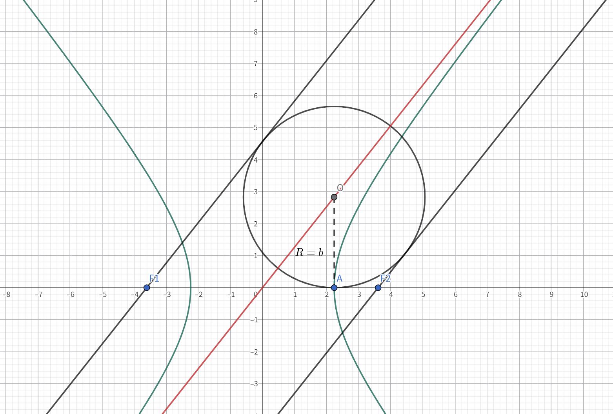

证毕。

### 渐近线相关

#### 渐进平行四边形

> 过双曲线上一点 $P(x_0,y_0)$ 作两条渐近线的平行线 $l_1,l_2$ 并分别与另一条渐近线交于点 $M,N$，设坐标原点为 $O$，那么平行四边形 $OMPN$ 的面积为定值 $\frac{ab}{2}$。
> 
> 等价结论：$|PM||PN|$ 的值为定值 $\frac{c^2}{4}$。

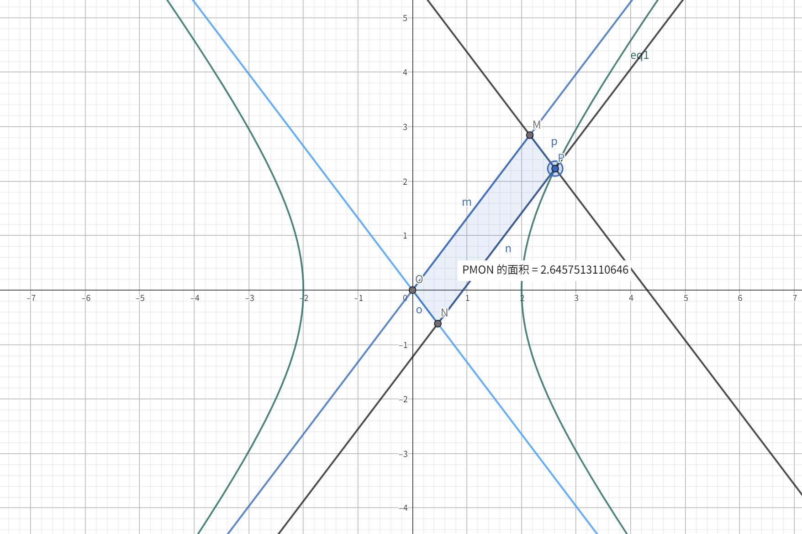

**评析**：可以先证明等价结论，因为根据三角形面积公式有 $S=\frac{1}{2}ab\sin C$，而两渐近线间夹角一定，即可导出渐进平行四边形的结论。

**证明**：

双曲线的渐近线为 $y=\pm\frac{b}{a}x$，分别设 $l_1,l_2$ 为 $y-y_0=\pm\frac{b^2}{a^2}(x-x_0)$。联立得交点 $M\left(\frac{x_0}{2}-\frac{ay_0}{2b},-\frac{bx_0}{2a}+\frac{y_0}{2}\right),N\left(\frac{x_0}{2}+\frac{ay_0}{2b},\frac{bx_0}{2a}+\frac{y_0}{2}\right)$。

可知 $|OM|=\sqrt{1+\frac{b^2}{a^2}}|\frac{x_0}{2}-\frac{ay_0}{2b}|,|ON|=\sqrt{1+\frac{b^2}{a^2}}|\frac{x_0}{2}+\frac{ay_0}{2b}|$。相乘：

$$|OM||ON|=(1+\frac{b^2}{a^2})|\frac{x_0^2}{4}-\frac{a^2y_0^2}{4b^2}|$$。

$P$ 在双曲线上，有 $\frac{x_0^2}{a^2}-\frac{y_0^2}{b^2}=1$，那么 $x_0^2=a^2+\frac{a^2y_0^2}{b^2}$，用离心率 $e^2$ 代换 $1+\frac{b^2}{a^2}$。化简得：

$$|OM||ON|=e^2\left(\frac{a^2}{4}+\frac{a^2y_0^2}{b^2}-\frac{a^2y_0^2}{b^2}\right)=\frac{c^2}{4}$$

计算渐近线夹角正弦值，它可通过二倍角公式得到，已知一条渐近线与坐标轴的夹角正切值为斜率 $\frac{b}{a}$，那么其正弦值为 $\frac{b}{\sqrt{a^2+b^2}}=\frac{b}{c}$，余弦值为 $\frac{a}{c}$。可得夹角 $\sin\theta=\frac{2ab}{c^2}$。

那么平行四边形面积 $S=|OM||ON|\sin\theta=\frac{ab}{2}$。

得证。

#### 共中点定理

> 双曲线上任意两点 $A,B$ 组成的线段与两渐近线分别交于 $C,D$ 点，则 $|AD|=|BC|,|AC|=|BD|$，线段 $CD$ 与线段 $AB$ 共中点。

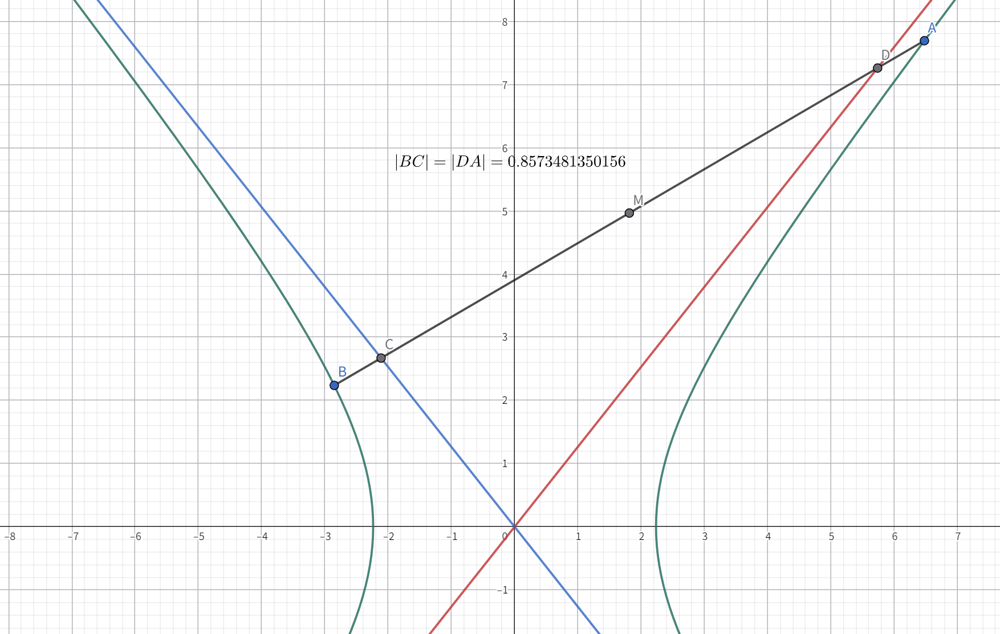

**证明**：

设 $AB:y=kx+m$，渐近线 $y=\pm\frac{b}{a}x$。先联立直线与双曲线方程，得到等式 $(b^2-a^2k^2)x^2-2a^2mkx-a^2m^2-a^2b^2=0$。

韦达定理表示 $x_1+x_2=\frac{2a^2mk}{b^2-a^2k^2},x_1x_2=-\frac{a^2m^2+a^2b^2}{b^2-a^2k^2}$。可得中点坐标 $M\left(\frac{a^2mk}{b^2-a^2k^2},\frac{b^2m}{b^2-a^2k^2}\right)$。

继续联立直线与两渐近线，这时计算较为方便。得到横坐标 $x_C=\frac{am}{b-ak},x_D=-\frac{am}{b+ak}$。设 $CD$ 中点为 $N$，则 $N\left(\frac{a^2mk}{b^2-a^2k^2},\frac{b^2m}{b^2-a^2k^2}\right)$

显然 $M$ 与 $N$ 重合，$AB$ 与 $CD$ 共中点，那么 $|CM|=|DM|,|AM|=|BM|$，可得 $|AD|=|AM|-|DM|=|BM|-|BC|=|BC|=t$，且 $|BD|=|AC|=|AB|-t$。

得证。

### 等角定理

> 双曲线的一条焦点弦交曲线于 $A,B$ 两点，设 $T$ 为双曲线的一条准线与焦点所在坐标轴的交点，那么有斜率 $k_{AT}+k_{BT}=0$。

**证明**：

不妨设 $T\left(\frac{a^2}{c},0\right)$，焦点弦 $l:y=k(x-c)$。联立方程：

$$
\begin{aligned}
b^2x^2-a^2(k^2x^2-2ck^2x+c^2k^2)-a^2b^2&=0
\\(-a^2k^2+b^2)x^2+2a^2ck^2x-a^2c^2k^2-a^2b^2&=0
\end{aligned}
$$

韦达定理得：$x_1+x_2=\frac{2a^2ck^2}{a^2k^2-b^2}\qquad x_1x_2=\frac{a^2c^2k^2+a^2b^2}{a^2k^2-b^2}$。

表示斜率：

$$
\begin{aligned}
&\phantom{=}k_1+k_2
\\&=\frac{y_1}{x_1-x_T}+\frac{y_2}{x_2-x_T}
\\&=\frac{kx_1-ck}{x_1-x_T}+\frac{kx_2-ck}{x_2-x_T}
\\&=\frac{2kx_1x_2-(ck+kx_T)(x_1+x_2)+2ckx_T}{x_1x_2-x_T(x_1+x_2)+x_T^2}
\end{aligned}
$$

即证 $2kx_1x_2-(ck+kx_T)(x_1+x_2)+2ckx_T=0$：

$$
\begin{aligned}
&=2kx_1x_2-(ck+kx_T)(x_1+x_2)+2ckx_T
\\&=\frac{2k^3a^2c^2+2a^2b^2k}{a^2k^2-b^2}-\frac{2k^3c^2a^2+2a^4k^3}{a^2k^2-b^2}+2a^2k
\\&=\frac{2k^3a^2c^2+2a^2b^2k-2k^3a^2c^2-2a^4k^3+2a^4k^3+2a^2b^2k}{a^2k^2-b^2}
\\&=0
\end{aligned}
$$

证毕。

### 光学性质

> 双曲线内部经过一个焦点的光束，在双曲线内表面上反射，反射光线的反向延长线将经过双曲线的另一个交点。

**评析**：同样抓住光线反射的“反射角等于入射角”原则，设直线，表示斜率，证明角度关系（角平分线关系）即可。

**证明**：

设双曲线上的反射点 $P(m,n)$，法线即双曲线在该点的切线，即 $l:\frac{m}{a^2}x-\frac{n}{b^2}y=1$，整理得 $l:y=\frac{b^2m}{a^2n}x-\frac{b^2}{n}$。

可得法线斜率 $\tan\theta_n=\frac{b^2m}{a^2n}$。同时可得入射光线和出射光线的斜率分别为：$\tan\theta_1=\frac{n}{m-c},\tan\theta_2=\frac{n}{m+c}$。即证，$\tan\theta_n=\tan\frac{\theta_1+\theta_2}{2}\rightarrow\tan2\theta_n=\tan(\theta_1+\theta_2)$。

并且 $P$ 在双曲线上，所以有 $\frac{m^2}{a^2}-\frac{n^2}{b^2}=1$，可得 $n^2=\frac{m^2b^2}{a^2}-b^2$。

利用正切的和角公式：

$$
\begin{aligned}
\tan(\theta_1+\theta_2)&=\dfrac{\frac{n}{m-c}+\frac{n}{m+c}}{1-\frac{n^2}{m^2-c^2}}
\\&=\dfrac{\frac{2mn}{m^2-c^2}}{\frac{m^2-c^2-n^2}{m^2-c^2}}
\\&=\dfrac{2mn}{m^2-c^2-n^2}
\\&=\dfrac{2mn}{m^2-a^2-b^2+b^2-\frac{b^2}{a^2}m^2}
\\&=\dfrac{2mn}{(1-\frac{b^2}{a^2})m^2-a^2}
\end{aligned}
$$

同时计算：

$$
\begin{aligned}
\tan2\theta_n&=\dfrac{\frac{2b^2m}{a^2n}}{1-(\frac{b^2m}{a^2n})^2}
\\&=\dfrac{\frac{2b^2m}{a^2n}}{1-\frac{b^4m^2}{a^4n^2}}
\\&=\dfrac{\frac{2b^2m}{a^2n}}{\frac{a^4n^2-b^4m^2}{a^4n^2}}
\\&=\dfrac{2a^2b^2mn}{a^4n^2-b^4m^2}
\\&=\dfrac{2mn}{\frac{a^2}{b^2}n^2-\frac{b^2}{a^2}m^2}
\\&=\dfrac{2mn}{m^2-a^2-\frac{b^2}{a^2}m^2}
\\&=\dfrac{2mn}{(1-\frac{b^2}{a^2})m^2-a^2}
\\&=\tan(\theta_1+\theta_2)
\end{aligned}
$$

证毕。

## 抛物线 基础二级结论

若无特殊说明，抛物线标准方程 $E: y^2=2px$ 均满足 $p>0$，焦点在 $x$ 轴正半轴。且若无特殊指明，“抛物线 $E$”均指上述的抛物线 $E:y^2=2px$。

### 通径

> 抛物线的通径长为 $2p$。

**评析**：抛物线中只要涉及到焦半径相关的内容，都要第一时间想到焦半径长等于该点与准线的距离从而进行转化，这样可以简化计算。

**证明**：

横坐标 $\frac{p}{2}$ 代入，得到焦半径为 $\frac{p}{2}+\frac{p}{2}=p$，通径为二倍焦半径，即 $2p$。

证毕。

### 焦点弦定理

> 抛物线 $E$ 的一条焦点弦交抛物线于 $A,B$ 两点，那么直线 $OA$ 与直线 $OB$ 的乘积为定值 $-4$。

**评析**：我们可以恰当选择直线的横截式和斜截式来方便计算。在本例中，由于抛物线方程的二次项在 $y$ 上，并且直线过 $x$ 轴上的定点，我们自然地选择横截式来进行计算。

**证明**：

令直线 $AB: x=ty+\frac{p}{2}$，联立抛物线方程 $y^2=2px$ 得：

$$
\begin{aligned}
y^2&=2pty+p^2
\\y^2-2pty-p^2&=0
\end{aligned}
$$

根据韦达定理，得：

$$
y_1+y_2=2pt\qquad y_1y_2=-p^2
\\x_1+x_2=2t(y_1+y_2)+p=4t^2p+p\qquad x_1x_2=t^2y_1y_2+\frac{pt}{2}(y_1+y_2)+\frac{p^2}{4}=\frac{p^2}{4}
$$

斜率的乘积表示为：

$$
\begin{aligned}
k_{OA}\cdot k_{OB}&=\frac{y_1y_2}{x_1x_2}
\\&=-\dfrac{p^2}{\frac{p^2}{4}}
\\&=-4
\end{aligned}
$$

证毕。

**拓展变形**：事实上，证明过程中由韦达定理导出的关系式 $x_1x_2=\frac{p^2}{4}$ 和 $y_1y_2=-p^2$ 在实践中更为常用一些。

### 两点弦公式

> 抛物线 $E$ 上两点 $A(x_1,y_1)$ 和 $B(x_2,y_2)$ 组成的弦 $AB$ 的斜率为 $\frac{2p}{y_1+y_2}$，两点弦公式为 $y=\frac{2p}{y_1+y_2}x+\frac{y_1y_2}{y_1+y_2}$，或 $2px-(y_1+y_2)y+y_1y_2=0$。

**评析**：适时避开繁琐的高次计算是非常有用的。

**证明**：

因为两点在抛物线上，因此坐标满足：

$$
\begin{cases}
y_1^2=2px_1
\\y_2^2=2px_2
\end{cases}\rightarrow\begin{cases}
x_1=\dfrac{y_1^2}{2p}
\\\qquad
\\x_2=\dfrac{y_2^2}{2p}
\end{cases}
$$

所以斜率可以表示为：$\dfrac{y_2-y_1}{x_2-x_1}=\dfrac{y_2-y_1}{\frac{y_2^2-y_1^2}{2p}}=\dfrac{2p(y_2-y_1)}{(y_1+y_2)(y_2-y_1)}=\dfrac{2p}{y_1+y_2}$。

进一步地联立得到整个两点弦公式为 $y=\frac{2p}{y_1+y_2}x+\frac{y_1y_2}{y_1+y_2}$，或整理得 $2px-(y_1+y_2)y+y_1y_2=0$。

证毕。

### 焦半径公式

> 抛物线 $E$ 的焦点弦 $AB$ 分别在第一象限和第四象限交抛物线于 $A,B$ 两点，直线 $AB$ 与 $x$ 轴的夹角是 $\theta$，那么 $|AF|=\dfrac{p}{1-\cos\theta},|BF|=\dfrac{p}{1+\cos\theta},|AB|=\dfrac{2p}{\sin^2\theta}$。

**评析**：直接看不太容易，来一张图辅助一下：

**证明**：

由抛物线定义知：$|AH|=|AF|=|GH|+|AG|=|GH|+|AF|\cos\theta=p+|AF|\cos\theta$，移项可得 $|AF|=\dfrac{p}{1-\cos\theta}$。同理可证得 $|BF|=\frac{p}{1+\cos\theta}$。

此时 $|AB|=|AF|+|BF|=\dfrac{p}{1-\cos\theta}+\dfrac{p}{1+\cos\theta}=\dfrac{2p}{\sin^2\theta}$。

证毕。

**拓展变形**：

事实上，尽管平常我们很少提及抛物线的离心率，但不代表它不存在。抛物线的离心率 $e=1$。容易发现抛物线的焦半径公式正是 $e=1$ 的特殊情况。

### 光学性质

> 抛物线内过焦点的光束，在抛物线内表面反射后，出射光线平行于抛物线焦点所在坐标轴。反之亦然。

**评析**：抛物线最大的好处就是少了一个平方项，因此相关计算会简便很多。此处仍然采取相同的证明角平分线的方法。

**证明**：

设反射点 $P(m,n)$，法线方程为 $l:ny=px+pm$，整理得 $l:y=\frac{p}{n}x+\frac{pm}{n}$。

因此法线斜率 $\tan\theta_n=\frac{p}{n}$，入射光线的斜率表示为 $\tan\theta=\frac{n}{m-\frac{p}{2}}=\frac{2n}{2m-p}$。

计算二倍角：

$$
\begin{aligned}
\tan2\theta_n&=\dfrac{\frac{2p}{n}}{1-\frac{p^2}{n^2}}
\\&=\dfrac{\frac{2p}{n}}{\frac{n^2-p^2}{n^2}}
\\&=\dfrac{2pn}{n^2-p^2}
\end{aligned}
$$

同时 $P$ 在双曲线上，有 $n^2=2pm$，继续化简：

$$
\begin{aligned}
&=\dfrac{2pn}{2pm-p^2}
\\&=\dfrac{2n}{2m-p}
\\&=\tan\theta
\end{aligned}
$$

即 $\theta=2\theta_n$，那么反射光线的斜率必为 ${0}$，也就是平行于抛物线焦点所在坐标轴。

证毕。

## $\texttt{Dandelin}$ 双球模型

> [!QUOTE]
> 用一个不垂直于圆锥的轴的平面截圆锥，当圆锥的轴与截面所成的角不同时，可以得到不同的截口曲线，它们分别是椭圆、抛物线和双曲线，我们通常把椭圆、抛物线、双曲线统称为**圆锥曲线**（conic sections）
> 
> <i>人教版 A 版高中数学《选择性必修 第一册》第三章引言</i>

很多同学十分了解圆锥曲线的求法、形状以及特征量关系，但是对它的起源却知之甚少。顾名思义，圆锥曲线必定和“圆锥”有关。事实上——正如引言所说，用一个不垂直圆锥的轴的平面去截圆锥，若得到一个平面，那么该截面的形状必定是椭圆、双曲线、抛物线其一，见下图：

当然，也存在一些特殊情形。例如当截面过圆锥顶点时，可能截出一个点，此时我们称这个圆锥曲线是退化的。退化的圆锥曲线在高中阶段没有讨论的必要，因此后文所有的圆锥曲线如无特殊说明均指代非退化的圆锥曲线。

了解了圆锥曲线的来源，那么我们将以何种方式求解这个截面曲线（圆锥曲线）的解析式呢？如果表示出平面和圆锥，再硬算交集曲线，显然划不来。200 多年前，人们发现了 $\texttt{Dandelin}$ 双球模型。如图：

该模型的主要内容是（椭圆为例）：两个球体与圆锥内表面相切，同时与形成圆锥曲线（此处为椭圆）的截面相切，它们与截面的交点为这个圆锥曲线（此处为椭圆）的两个焦点，因此 $\texttt{Dandelin}$ 双球有时又叫做“焦球”。

### 截口曲线

> 设双球与截口曲线的切点分别为 $F_1,F_2$，那么该截口曲线为以这两点为焦点的圆锥曲线（本例为椭圆）

**评析**：可以利用切线长定理的三维形式来解决。

**证明**：

本结论证明过程中的标记与下图相同：

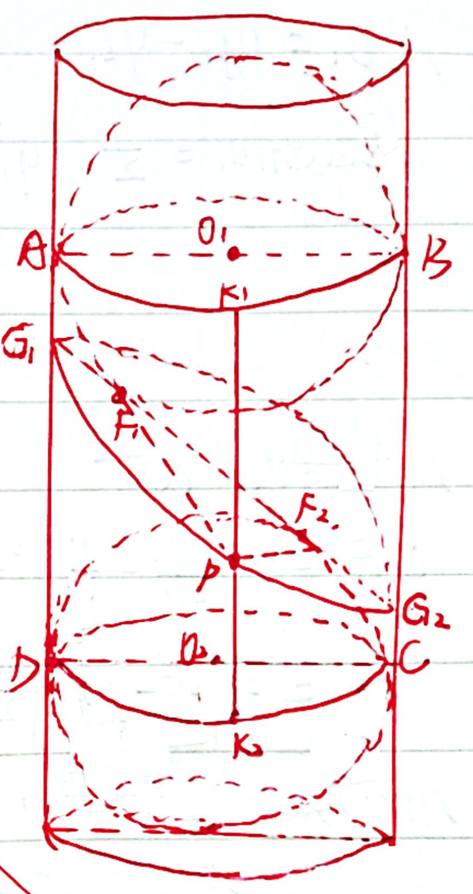

根据切线长定理的扩展，可得线段长满足 $PF_1=PK_1,PF_2=PK_2$，那么 $PF_1+PF_2=PK_1+PK_2=AD$，线段长 $AD$ 显然为定值。那么接口曲线为椭圆，线段长 $AD$ 视作椭圆（第一）定义中的 $2a$，同时可得 $F_1,F_2$ 为焦点。

证毕。

**拓展变形**：关于切线长定理及其三维扩展形式。

我们初中就知道，过圆外一点引圆的两条切线，那么该点与两个切点分别连成的线段长度相等。那么为什么这个结论放在球体中也成立呢？先来看看推论内容：

> 在三维空间中，过球体外一点引球体的若干切线，那么这些切线长均相等。

只引出两条切线时，过这两个切点可以截出一个圆形，此时与二维形式相同。如果切线多于两条，我们可以将球外的点与球心相连，然后连接球心与切点，它与切线必垂直，因此所有切线长度均为 $\sqrt{D^2-R^2}$，其中 $D$ 为圆外点与圆心距离、$R$ 为球半径。

### 焦点

> 如图，$\texttt{Dandelin}$ 双球与截面圆锥曲线的切点为该圆锥曲线的焦点。线段长满足 $EQ=PG=AB=2a,BH=2c$。

**评析**：利用切线长定理可以证明该结论。

**证明**：

根据切线长定理，左侧母线有 $AQ=AF,AD=AE$；右侧母线有：$BP=BF,BD=BG$。因此有 $AD+AF=BF+BD=EQ=PG$。

该模型的已知条件是：$A,B$ 为截面圆锥曲线的长轴端点，因此 $AB=2a$；并且 $DF=2c$。图中 $AH// A_1B_1$，因而又有 $AE=GH$。

对等式两边同时减去公共线段长 $DF$ 得：${2}AD=2BF\rightarrow AD=BF$，因此 $EQ=AD+AF=BF+AF=AB=2a$，同理可得 $PG=AB=2a$。用 $a,c$ 表示各边，即 $BD=BG=a+c,BF=a-c$，所以 $BH=BG-GH=BG-AE=BG-AD=BD-AD=(a+c)-(a-c)=2c$。

证毕。

### 离心率

> 如上图，截面截出的圆锥曲线离心率为 $e=\frac{\sin\beta}{\sin\alpha}$，其中 $\alpha,\beta$ 分别为 $\angle AHC,\angle BAH$。或者 $e=\frac{\cos\gamma}{\cos\theta}$，其中 $\gamma,\theta$ 分别为 $AB,AC$ 与圆锥高的夹角。

**评析**：在 $\triangle ABH$ 里用正弦定理证明。

**证明**：

在 $\triangle ABH$ 中，正弦定理有 $e=\frac{BH}{AB}=\frac{c}{a}=\frac{\sin\beta}{\sin\alpha}$，与 $\frac{\cos\gamma}{\cos\theta}$ 等价。

证毕。

## 椭圆-双曲线共焦点问题

在本章中，我们默认存在一个椭圆 $E_1: \frac{x^2}{a_1^2}+\frac{y^2}{b_1^2}=1$ 与 $E_2:\frac{x^2}{a_2^2}-\frac{y^2}{b_2^2}=1$ 共焦点。若无特殊说明，$P$ 为两圆锥曲线在第一象限内的交点，$\angle F_1PF_2=\theta$。如下图：

### 焦半径

> 共焦点的椭圆和双曲线满足 $|PF_1|=a_1+a_2,|PF_2|=a_1-a_2$。

**评析**：注意利用好椭圆和双曲线的定义。

**证明**：

在椭圆中，有 $|PF_1|+|PF_2|=2a_1$；在双曲线中，有 $|PF_1|-|PF_2|=2a_2$，两式相加得 ${2}|PF_1|=2a_1+2a_2$，相减得 ${2}|PF_2|=2a_1-2a_2$。由此得到：

$$
|PF_1|=a_1+a_2\qquad |PF_2|=a_1-a_2
$$

证毕。

### 离心率与角的关系

> 共焦点的椭圆和双曲线满足 $\dfrac{\sin^2\frac{\theta}{2}}{e_1^2}+\dfrac{\cos^2\frac{\theta}{2}}{e_2^2}=1$

**评析**：同样是有角有边，考虑正/余弦定理。这个结论可以帮助你快速解决诸如 $e_1^2e_2^2,\frac{1}{e_1^2}+\frac{1}{e_2^2}$ 等式子的最值问题。

**证明**：

借用上一节的焦半径结论，并综合余弦定理，可以得到：

$$
\begin{aligned}
a_1^2+a_2^2+2a_1a_2+a_1^2+a_2^2-2a_1a_2-2(a_1^2-a_2^2)\cos\theta&=4c^2
\\2a_1^2+2a_2^2-2a_1^2\cos\theta+2a_2^2\cos\theta&=4c^2
\\(1-\cos\theta)a_1^2+(1+\cos\theta)a_2^2&=2c^2
\\\dfrac{(1-\cos\theta)a_1^2}{2c^2}+\dfrac{(1+\cos\theta)a_2^2}{2c^2}&=1
\\\dfrac{1-\cos\theta}{2e_1^2}+\dfrac{1+\cos\theta}{2e_2^2}&=1
\\\dfrac{\sin^2\frac{\theta}{2}}{e_1^2}+\dfrac{\cos^2\frac{\theta}{2}}{e_2^2}&=1
\end{aligned}
$$

证毕。

**拓展变形**：正余弦函数的升幂/降幂公式。

由余弦的二倍角公式 $\cos\theta=2\cos^2\frac{\theta}{2}-1=1-2\sin^2\frac{\theta}{2}$，得到 $\sin^2\frac{\theta}{2}=\frac{1-\cos\theta}{2},\cos^2\frac{\theta}{2}=\frac{1+\cos\theta}{2}$。即证得降幂公式。事实上，余弦的二倍角公式就是升幂公式。

## 仿射变换

我们接下来要用一个颇具线性代数色彩（JustPureH2O 色彩）的章节来为圆锥曲线的相关面积问题铺路，它就是“仿射变换”。通过对原图形进行适当拉伸变换，将复杂的圆锥曲线转换成特殊的、简单的几何图形（一般是圆）来简化计算。借用仿射变换的知识，我们可以证明椭圆的面积公式，并一定程度上解释椭圆不存在精确的周长公式的根本原因。在探讨这两个问题前，我们先引入仿射变换的相关内容：

> 仿射变换，又称仿射映射，是指在几何中，一个向量空间进行一次线性变换并接上一个平移，变换为另一个向量空间的过程。

简单来说就是对一个图形进行平移、缩放（整体缩放/方向缩放）、旋转等变换。例如椭圆 $E:\frac{x^2}{4}+y^2=1$，我们可以仅在 $x$ 轴方向上缩放，将椭圆上点的横坐标全部除以 ${2}$，可以得到一个圆 $E^\prime:x^2+y^2=1$。

仿射变换前后，原图形/若干相关图形有几个不变的量/关系：

1. 共线性：共线的若干点在变换后仍共线
2. 平行性：两平行直线在变换后仍平行
3. 等比性：某线段上的点将该线段分为长度 $a:b$ 的两条线段，变换后该点分得的两线段长之比仍为 $a:b$

第一条性质是明显的；对于第二条、第三条，我们可以借用物理的正交分解思想来解决：在原平行直线上各取两点，算出斜率 $k=\frac{\Delta y}{\Delta x}$，变换后两直线的斜率均为 $k^\prime=\frac{m\Delta y}{n\Delta n}$，因此它们仍然平行。第三条采用相同的方法也可以证。

从上面三条基本性质可以进一步推出——当仿射变换的内容是将图形在 $x$ 轴方向伸长 $a$ 倍，在 $y$ 轴方向伸长 $b$ 倍时，新图形的面积将是原图形的 $a\times b$ 倍。最好的例子就是椭圆 $\frac{x^2}{a^2}+\frac{y^2}{b^2}=1$ 的面积公式 $S=\pi ab$，因为它可看做圆 $x^2+y^2=1$ 在 $x$ 方向伸长 $a$ 倍、在 $y$ 方向伸长 $b$ 倍的结果。

但是，某线段在经过仿射变换后，其长度并非简单满足“按比缩放”的关系。这点可以借用物理的正交分解思想来证明：假如一条线段，在 $x,y$ 轴方向各伸长 $a,b$ 倍，如下图（$a=2,b=3$）。

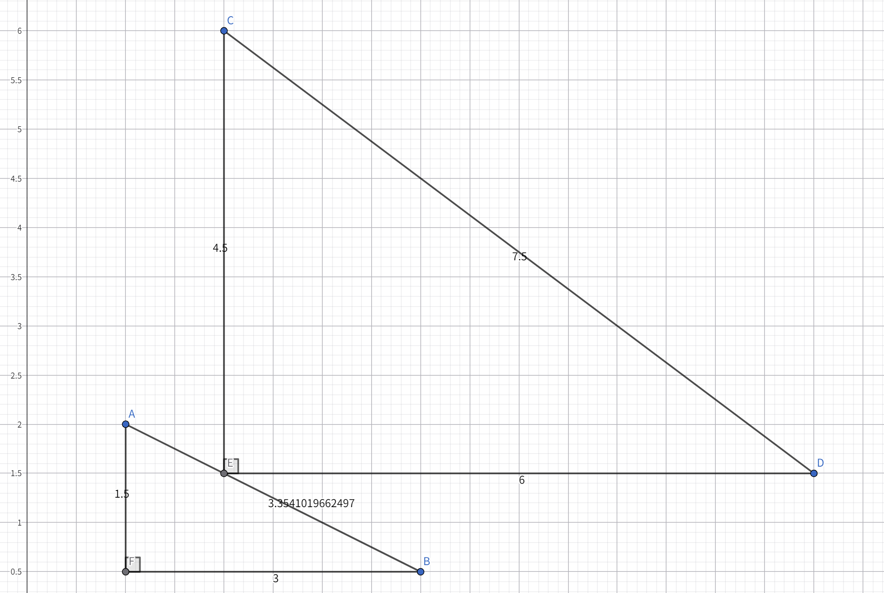

原线段长度为 $\sqrt{11.25}$，变换后为 ${7.5}$。二者之间并非与 $a,b$ 线性相关。正交分解可得两直线长度关系满足 $L=\sqrt{\Delta x^2+\Delta y^2},L^\prime=\sqrt{a^2\Delta x^2+b^2\Delta y^2}$，二者没有简单的线性关系。根据前文，椭圆可从圆变换而来，在圆上取极小的一段弧，近似把它看做一条极小长度的线段，它变换后的长度与原长并非简单线性关系，因而椭圆周长与该圆周长无简单关系——这在一定程度上可以说明不存在用初等函数表示的椭圆周长公式（近似公式不算）。

利用仿射变换，我们可以轻松证得蒙日圆中部分面积相关问题的二级结论。

## 蒙日圆

圆锥曲线 $E$ 上任意两条互相垂直的切线焦点的轨迹组成了一个圆，称作蒙日圆【又称外准圆（对于椭圆）、内准圆（对于双曲线）】。椭圆 $\frac{x^2}{a^2}+\frac{y^2}{b^2}=1$ 的蒙日圆为 $x^2+y^2=a^2+b^2$。如下图：

双曲线 $\frac{x^2}{a^2}-\frac{y^2}{b^2}=1$ 的蒙日圆为 $x^2+y^2=a^2-b^2$，仅在 $a>b>0$ 时成立，如下图：

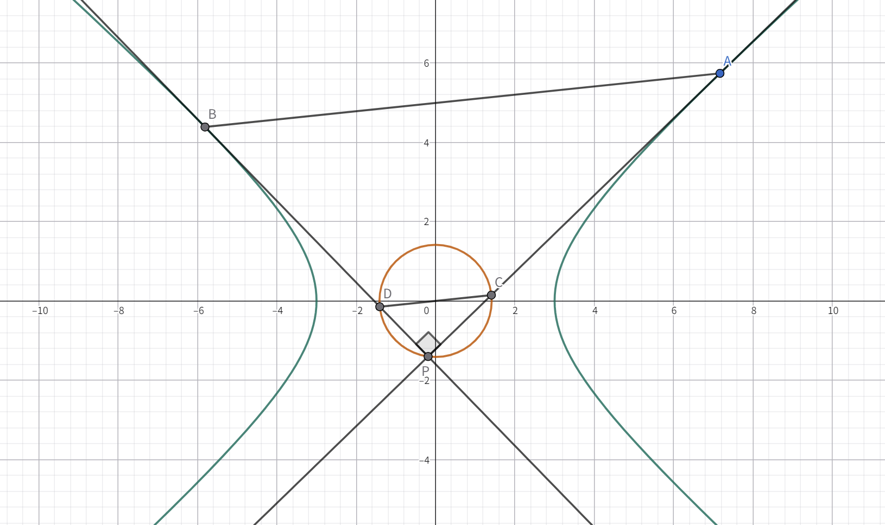

抛物线的蒙日圆为其准线 $x=-\frac{p}{2}$。证明见后文“阿基米德三角形——几何性质 其三”小节。

圆亦有其蒙日圆，解析式与椭圆相同，可看做椭圆在 $a=b$ 时的特殊情况。

一般来说，椭圆的蒙日圆考察较多，而双曲线较少，本章着重介绍椭圆的情况。

若无特殊说明，圆锥曲线的两切线交于 $P$，且与圆锥曲线分别交于点 $A$ 和 $B$，与蒙日圆分别交于点 $C$ 和 $D$。

### 轨迹方程（解析法）

> 椭圆的蒙日圆方程为 $x^2+y^2=a^2+b^2$；双曲线的蒙日圆方程为 $x^2+y^2=a^2-b^2$（$a>b>0$）。

**评析**：双曲线和椭圆是一体两面，因此这里只介绍椭圆的相关证明。

**证明**：

切线斜率不存在时，$P(\pm a,\pm b)$，显然在圆 $x^2+y^2=a^2+b^2$ 上。

切线斜率存在时，设 $PM:y=kx+m$，则根据垂直关系有 $PN:y=-\frac{1}{k}x+n$。

联立 $PM$ 与椭圆方程，并根据相切关系得：

$$
\begin{aligned}
(b^2+a^2k^2)x^2+2a^2mkx+a^2m^2-a^2b^2&=0
\\\Delta&=0
\\4a^4m^2k^2-4a^2(b^2+a^2k^2)(m^2-b^2)&=0
\\a^2k^2+b^2-m^2&=0
\\m^2&=a^2k^2+b^2
\end{aligned}
$$

同理可得 $\frac{a^2}{k^2}+b^2-n^2=0\rightarrow a^2+b^2k^2=n^2k^2$。

联立两直线方程得到 $P\left(\frac{k(n-m)}{k^2+1},\frac{nk^2+m}{k^2+1}\right)$，此时 $|OP|^2=\frac{n^2k^2+m^2}{k^2+1}=\frac{a^2+b^2k^2+a^2k^2+b^2}{k^2+1}=a^2+b^2$。因此 $P$ 在圆 $x^2+y^2=a^2+b^2$ 上。

证毕。

### 轨迹方程（几何法）

该方法由一位与我同班的数竞大佬提供。证明相关辅助线如下图：

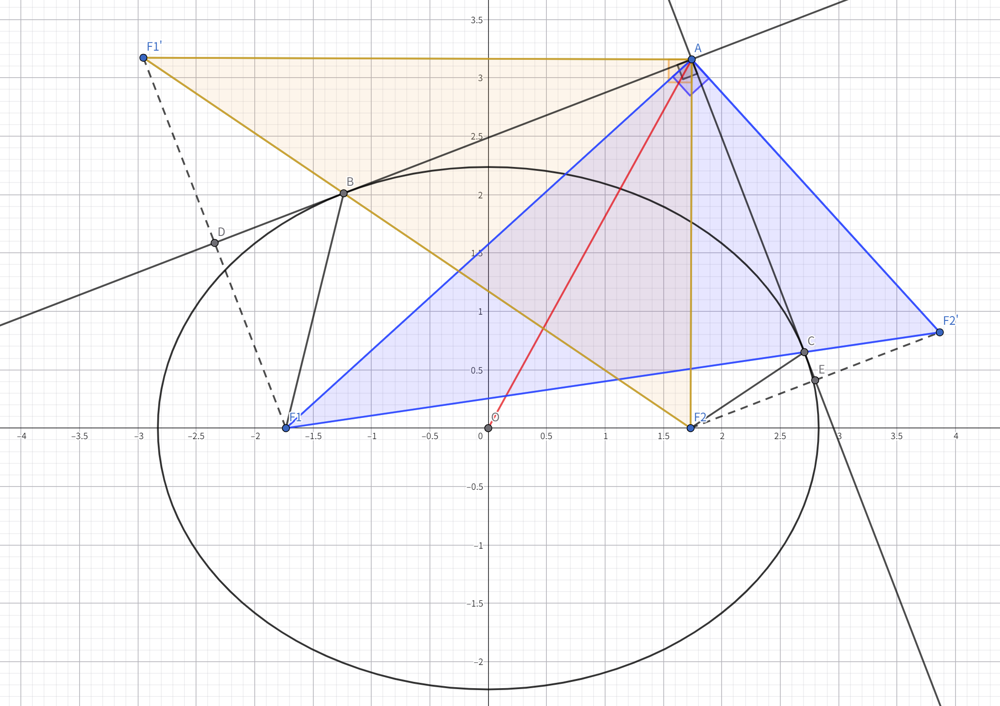

**证明**：

点 $A$ 向椭圆 $E$ 引两条垂直切线，切点分别为 $A,B$。作两焦点 $F_1,F_2$ 关于 $AB,AC$ 的对称点 $F_1^\prime,F_2^\prime$。如图连接线段。

由椭圆光学性质可得，$F_1,C,F_2^\prime$ 三点共线；$F_2,B,F_1^\prime$ 三点共线。又有对称关系，可得 $AF_1=AF_1^\prime,AF_2=AF_2^\prime,BF_1=BF_1^\prime,AF_2=AF_2^\prime$，从而有 $F_1^\prime F_2=F_2^\prime F_1=2a$。

三边相等，据此判定 $\triangle AF_2F_1^\prime\cong\triangle AF_2^\prime F_1$。有 $\angle F_1AF_2^\prime=\angle F_1^\prime AF_2$。

同时减去公共角 $\angle F_1AF_2$ 得 $\angle F_1^\prime AF_1=\angle F_2^\prime AF_2$，再根据对称关系，有 $\angle F_1^\prime AD=\angle DAF_1=\angle F_2AE=\angle EAF_2^\prime$。

已知 $\angle BAC=90\degree$，那么 $\angle F_1AF_2^\prime=\angle F_1AE+\angle EAF_2^\prime=\angle F_1AE+\angle DAF_1=\angle BAC=90\degree=\angle F_1^\prime AF_2$。

在有公共边的两三角形 $\triangle AOF_1,\triangle AOF_2$ 中，有 $\angle AOF_1+\angle AOF_2=180\degree$，根据余弦定理有：

$$
\begin{aligned}
\cos\angle AOF_1+\cos\angle AOF_2&=0
\\\frac{|OA|^2+|OF_1|^2-|AF_1|^2}{2|OA||OF_1|}+\frac{|OA|^2+|OF_2|^2-|AF_2^2|}{2|OA||OF_2|}&=0
\\2|OA|^2+|OF_1|^2+|OF_2|^2-|AF_1|^2-|AF_2|^2&=0
\end{aligned}
\\\begin{aligned}
\\|OA|^2&=\frac{|AF_1|^2+|AF_2|^2}{2}-c^2
\\&=\frac{|F_1F_2^\prime|^2}{2}-c^2
\\&=\frac{(|CF_1|+|CF_2|)^2}{2}-c^2
\\&=2a^2-c^2
\\&=a^2+b^2
\end{aligned}
$$

证毕。

### 几何性质 其一

> 蒙日圆上一点 $P$ 引出的两条切线交蒙日圆于 $C,D$ 两点，直线 $CD$ 过原点。

**评析**：无

**证明**：

根据圆内直径所对的圆周角恒为直角的关系，可得 $CD$ 为蒙日圆直径，即 $C,O,D$ 三点共线、$CD$ 过原点。

证毕。

### 广义垂径定理

> $P$ 为蒙日圆上一点，过 $P$ 作椭圆 $E$ 的两条切线 $PA,PB$，切点为 $A,B$，连接 $OP$，则 $k_{OP}\cdot k_{AB}=-\frac{b^2}{a^2}$。

**评析**：利用圆锥曲线的切点弦方程即可快速解决。

**证明**：

令 $P(x_0,y_0)$，那么 $k_{OP}=\frac{y_0}{x_0}$。根据圆锥曲线的切点弦公式，得到切点弦 $AB:\frac{x_0}{a^2}x+\frac{y_0}{b^2}y=1$，得到 $k_{AB}=-\frac{b^2x_0}{a^2y_0}$。相乘即得结果 $-\frac{b^2}{a^2}$。

证毕。

**拓展变形**：椭圆交点所在坐标轴变化后仍然会变成 $-\frac{a^2}{b^2}$。同时根据结果和中点弦公式可以得知 $AB$ 与 $OP$ 的交点 $M$ 为 $AB$ 中点。

### 几何性质 其二

> 蒙日圆上一点 $P$ 向椭圆引两条切线 $PA$ 和 $PB$，交椭圆于 $A,B$，交蒙日圆于 $C,D$，$OP$ 交 $AB$ 于 $M$ 点，有 $AB//CD$。

**评析**：利用几何关系进行证明。前置是上面的广义垂径定理和几何性质一。

**证明**：

根据蒙日圆，得到顶角 $\angle APB=90\degree$。根据上面广义垂径定理得到的 $M$ 为 $AB$ 中点的关系，结合直角三角形斜边上的中线定理，可以得到 $PM=PA=PB$，所以 $\angle APO=\angle OAP$。同样在大直角三角形 $PCD$ 中类似地又有 $\angle DCP=\angle OAP$，因此 $\angle DCP=\angle APO$。同位角相等，两直线平行。

证毕。

**拓展变形**：根据这条性质，广义垂径定理可以推广成 $k_{OP}\cdot k_{CD}=-\frac{b^2}{a^2}$。

### 几何性质 其三

> 从蒙日圆上一点 $P$ 向椭圆 $E$ 引两条切线 $PA,PB$，切点为 $A,B$。那么 $k_{OA}k_{AP}=k_{OB}k_{BP}=-\frac{b^2}{a^2},k_{OA}k_{OB}=-\frac{b^4}{a^4}$。

**评析**：运用切线公式和已知的垂直条件快速解题。

**证明**：

令 $A(x_1,y_1),B(x_2,y_2)$，则根据切线公式得 $PA:\frac{x_1}{a^2}x+\frac{y_1}{b^2}y=1$，斜率为 $-\frac{b^2x_1}{a^2y_1}$，乘积为 $-\frac{b^2x_1}{a^2y_1}\cdot\frac{y_1}{x_1}=-\frac{b^2}{a^2}$。同理可以证得 $k_{OB}k_{PB}=-\frac{b^2}{a^2}$。

综合以上两式 $k_{OA}k_{PA}=k_{OB}k_{PB}=-\frac{b^2}{a^2}$，得 $k_{OA}k_{OB}k_{PA}k_{PB}=\frac{b^4}{a^4}$，根据蒙日圆的切线垂直条件 $k_{PA}k_{PB}=-1$，得到 $k_{OA}k_{OB}=-\frac{b^4}{a^4}$。

证毕。

### 蒙日圆三角形相关（仿射变换）

> 在外准圆中：$\triangle AOB$ 的面积最大为 $\frac{a^4}{a^2+b^2}$，最小为 $\frac{b^4}{a^2+b^2}$；$\triangle APB$ 的面积最大为 $\frac{ab}{2}$，最小为 $\frac{a^2b^2}{a^2+b^2}$。

**评析**：由于仿射变换对图形面积的改变是简单的倍数关系，我们将难以计算的椭圆变成圆，再利用圆的切线相关性质定理，即可大大简化计算量。

**证明**：

假设椭圆 $E:\frac{x^2}{a^2}+\frac{y^2}{b^2}=1$，有蒙日圆 $C:x^2+y^2=a^2+b^2$。不妨设 $a>b>0$，那么将所有点的 $y$ 坐标乘以 $\frac{a}{b}$。得到圆 $E^\prime:x^2+y^2=a^2$ 和竖椭圆 $C^\prime:x^2+\frac{b^2y^2}{a^2}=a^2+b^2$。如下图：

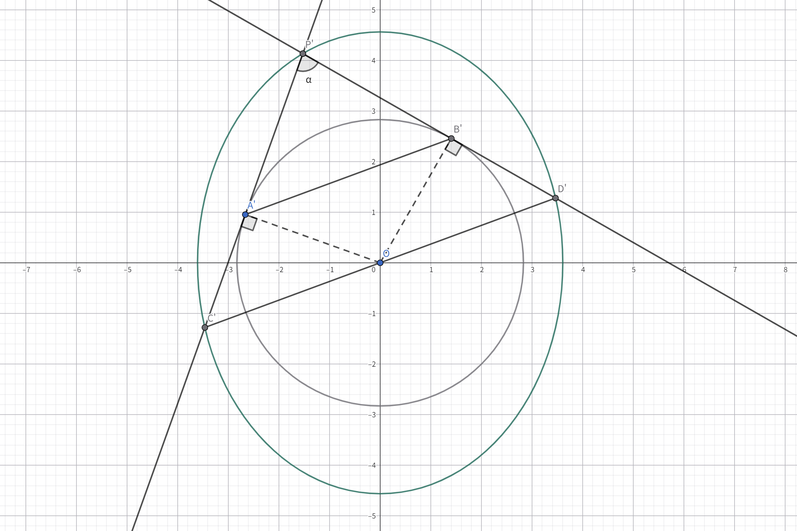

由图可得 $S_{\triangle P^\prime A^\prime B^\prime}=\frac{1}{2}|P^\prime B^\prime||P^\prime A^\prime|\sin\alpha$。根据切线长定理有 $|P^\prime B^\prime|=|P^\prime A^\prime|$，且 $|P^\prime A^\prime|^2=|OP^\prime|^2-|OB^\prime|^2=a^2+b^2-a^2=b^2$。

那么 $S_{\triangle P^\prime A^\prime B^\prime}=\frac{1}{2}b^2\sin\alpha$。现证明存在 $P^\prime$ 使得 $\alpha=90\degree$。由图易知 $\alpha$ 的最值分别在 $P^\prime\left(0,\frac{a^4+a^2b^2}{b^2}\right)$ 和 $P^\prime(a^2+b^2,0)$ 时取。现证明 $\alpha_{min}\leq90\degree,\alpha_{max}\geq90\degree$。

$\alpha$ 最大时，因为 $C^\prime$ 为竖椭圆，那么 $\angle OP^\prime C=\frac{\alpha_{max}}{2}>45\degree$。根据对称性，$\angle P^\prime C^\prime O=\frac{\alpha_{min}}{2}<45\degree$。那么一定存在 $P^\prime$，使得 $\alpha=90\degree$。不难发现，此时两切线平行于坐标轴。

由图可知 $\sin\frac{\alpha_{min}}{2}=\frac{b}{\sqrt{a^2+b^2}},\cos\frac{\alpha_{min}}{2}=\frac{a}{\sqrt{a^2+b^2}}$，那么 $\sin\alpha_{min}=\frac{2ab}{a^2+b^2}$。

因此，$S_{\triangle P^\prime A^\prime B^\prime}=\frac{1}{2}b^2\sin\alpha\in\left[\frac{2ab^3}{a^2+b^2},\frac{1}{2}b^2\right]$

根据仿射变换，原面积 $S=\frac{s}{b}S^\prime$，得 $\frac{a^2b^2}{a^2+b^2}\geq S_{\triangle PAB}\leq\frac{ab}{2}$。

由对称性，$\angle A^\prime OB^\prime=180\degree-\alpha$。它们同取最大/最小值，代入角度可得 $S_{\triangle AOB}\in[\frac{b^4}{a^2+b^2},\frac{a^4}{a^2+b^2}]$。

证毕。

## 阿基米德三角形

抛物线的某条弦 $AB$，过 $A,B$ 的两条抛物线的切线相交于 $P$ 点，三角形 $PAB$ 称作这个抛物线的阿基米德三角形。如下图：

$\triangle ABP$ 和 $\triangle CDQ$ 都是这个抛物线的阿基米德三角形。

若无特殊说明，本章中的抛物线 $E$ 均指代抛物线 $y^2=2px(p>0)$。

### 几何性质 其一

> 阿基米德三角形在抛物线上的弦的中点为 $M$，那么该弦所对的顶点 $P$ 满足 $PM//x$。

**评析**：巧妙运用切线方程解决问题。

**证明**：

令弦的端点 $A(x_1,y_1),B(x_2,y_2)$，点在抛物线上得 $x_1=\frac{y_1^2}{2p},x_2=\frac{y_2^2}{2p}$。根据切线方程得 $PA:y_1y=px+px_1$，同理得 $PB:y_2y=px+px_2$，联立解得交点 $P(\frac{y_1y_2}{2p},\frac{y_1+y_2}{2})$。中点得 $M(\frac{y_1^2+y_2^2}{4p},\frac{y_1+y_2}{2})$，得到 $PM//x$。

证毕。

### 几何性质 其二

> 当阿基米德三角形在抛物线上的弦过定点 $G(x_0,y_0)$ 时，该弦所对顶点的运动轨迹为 $y_0y=p(x+x_0)$。

**评析**：利用切点弦公式，或者是几何性质一可以证明。此处选用几何性质一进行证明。

**证明**：

令底边 $A(x_1,y_1),B(x_2,y_2)$，根据几何性质一得顶点 $P(\frac{y_1y_2}{2},\frac{y_1+y_2}{2})$。因为定点 $G$ 在 $AB$ 上，应有 $k_{AB}=k_{AG}$，即：

$$
\begin{aligned}
\dfrac{y_2-y_1}{x_2-x_1}&=\dfrac{y_1-y_0}{x_1-x_0}
\\\dfrac{y_2-y_1}{\frac{y_2^2}{2p}-\frac{y_1^2}{2p}}=\dfrac{2p}{y_1+y_2}&=\dfrac{y_1-y_0}{\frac{y_1^2}{2p}-x_0}
\\y_1^2-2px_0&=y_1^2+y_1y_2-y_0(y_1+y_2)
\\2px_0&=y_0(y_1+y_2)-y_1y_2
\\2px_0&=2y_0y_P-2x_P
\\y_0y_P&=p(x_0+x_P)
\end{aligned}
$$

因此 $P$ 在直线 $y_0y=p(x+x_0)$ 上。

证毕。

**拓展变形**：此结论的推论有——当底边过焦点时，顶点的轨迹为抛物线准线；底边过 $x$ 轴定点 $(a,0)$ 时，顶点轨迹为直线 $x=-a$。

### 几何性质 其三

> 当阿基米德三角形的底边过焦点时，阿基米德三角形的顶角为 ${90}\degree$，即 $PA\perp PB$。

**评析**：可以借助几何性质一来快速解决。

**证明**：

令 $A(x_1,y_1),B(x_2,y_2)$，由几何性质一可得 $P(\frac{y_1y_2}{2p},\frac{y_1+y_2}{2})$。两切线斜率之积为：

$$
\begin{aligned}
k_1k_2&=\dfrac{y_1-\frac{y_1+y_2}{2}}{x_1-\frac{y_1y_2}{2p}}\times\dfrac{y_2-\frac{y_1+y_2}{2}}{x_2-\frac{y_1y_2}{2p}}
\\&=\dfrac{\frac{y_1-y_2}{2}}{\frac{y_1^2-y_1y_2}{2p}}\times\dfrac{\frac{y_2-y_1}{2}}{\frac{y_2^2-y_1y_2}{2p}}
\\&=\dfrac{p(y_1-y_2)}{y_1(y_1-y_2)}\times\dfrac{p(y_2-y_1)}{y_2(y_2-y_1)}
\\&=\dfrac{p^2}{y_1y_2}
\end{aligned}
$$

最后联系到抛物线焦点弦定理中 $y_1y_2=-p^2$（设直线代入韦达定理得出）可以得到斜率之积为 $-1$，即两直线垂直。

证毕。

### 几何性质 其四

> 在阿基米德三角形中，恒有 $\angle PFA=\angle PFB$。

**评析**：几何法搭配解析几何解题较为快速。

**证明**：

过 $A,B$ 分别作准线的垂线 $AA_1,BB_1$，垂足为 $A_1,B_1$，连接 $A_1P,B_1P,A_1F$，$A_1F\cap AP=O$，如下图：

令 $A(x_1,y_1),B(x_2,y_2)$，根据切线公式可得 $PA:y=\frac{p}{y_1}x+\frac{px_1}{y_1}$，得到斜率 $k_{PA}=\frac{p}{y_1}$。由垂直得 $A_1(-\frac{p}{2},y_1)$，因此 $A_1F$ 斜率为 $-\frac{y_1}{p}$，乘积为 $-1$，有 $AP\perp A_1F$。

在抛物线中，有 $|AA_1|=|AF|$，根据直角三角形 HL 型全等得 $\triangle A_1AO\cong\triangle FAO$，进而有 $\angle A_1AO=\angle FAO$；再次可 SAS 证得 $\triangle A_1AP\cong\triangle FAP$。

仿照上述全等推导可证得 $\triangle BFP\cong\triangle BB_1P$。那么 $\angle PFB=\angle BB_1P,\angle PFA=\angle PA_1A$。

根据几何性质一可得，$y_P=\frac{y_1+y_2}{2}$，就有 $A_1P=B_1P$，$\angle PA_1B_1=\angle PB_1A_1$，因此 $\angle PA_1A=\angle PB_1B=90\degree+\angle PA_1B_1$，进而得到 $\angle PFB=\angle PFA$。

证毕。

### 几何性质 其五

> 在阿基米德三角形中，有 $|AF|\cdot|BF|=|PF|^2$。

**评析**：根据性质一得出的点的坐标代入计算即可验证。

**证明**：

根据性质一可得 $P(\frac{y_1y_2}{2p},\frac{y_1+y_2}{2})$，距离公式可得 $|PF|^2=(\frac{y_1y_2}{2p}-\frac{p}{2})^2+(\frac{y_1+y_2}{2})^2=\frac{p^2}{4}+\frac{y_1^2y_2^2}{4p^2}+\frac{y_1^2+y_2^2}{4}$。

同时，在抛物线中满足 $|AF|=x_A+\frac{p}{2}=\frac{y_1^2}{2p}+\frac{p}{2}$；同理有 $|BF|=x_B+\frac{p}{2}=\frac{y_2^2}{2p}+\frac{p}{2}$。相乘：

$$
\begin{aligned}
|AF|\cdot|BF|&=\left(\frac{y_1^2}{2p}+\frac{p}{2}\right)\times\left(\frac{y_2^2}{2p}+\frac{p}{2}\right)
\\&=\frac{y_1^2y_2^2}{4p^2}+\frac{p^2}{4}+\frac{y_1^2+y_2^2}{4}
\\&=|QF|^2
\end{aligned}
$$

证毕。

### 几何性质 其六

> 底边 $AB$ 长为 $a$ 的阿基米德三角形的面积最大值为 $\frac{a^3}{8p}$。

**评析**：利用三角形面积等于底乘高除以二，再对高的长度进行放缩即可。

**证明**：

如图：$PH$ 为 $\triangle APB$ 在 $AB$ 边上的高，$M$ 为 $AB$ 中点。令 $AB:x=ky+b$。

易知 $|PH|\leq|PM|$，在 $AB\perp x$ 时等号成立。$|AB|=a=\sqrt{(k^2+1)(y_1-y_2)^2}\geq\sqrt{(y_1-y_2)^2}$。

根据性质一，$P(\frac{y_1y_2}{2p},\frac{y_1+y_2}{2})$，$M(\frac{x_1+x_2}{2},\frac{y_1+y_2}{2})$，$|PM|=\frac{x_1+x_2}{2}-\frac{y_1y_2}{2p}=\frac{y_1^2+y_2^2}{4p}-\frac{y_1y_2}{2p}=\frac{(y_1-y_2)^2}{4p}$。

此时 $S_{\triangle APB}\leq\frac{1}{2}a\frac{(y_1-y_2)^2}{4p}\leq\frac{a^3}{8p}$，当且仅当 $AB\perp x$ 时取得等号。

证毕。

## 非对称韦达定理

非对称韦达定理主要用来处理二次方程根的非对称表达式，将其化简为可应用一般韦达定理，或直接得到常数形式。它经常出现在圆锥曲线焦点弦线段长成比例相关问题的计算过程中。

本章将着重介绍非对称韦达的几种常用处理方法。

### 和积转化

> [!TIP]
> 该方法主要适用于 $x_1x_2$（乘积项）与 $x_1,x_2$（一次项）同时出现的分式的求解

我们假设有一直线 $y=kx+m$ 和圆锥曲线 $\frac{x^2}{a^2}+\frac{y^2}{b^2}=1$，联立二者可得：

$$
\begin{aligned}
b^2x^2+a^2(k^2x^2+2mkx+m^2)-a^2b^2&=0
\\(b^2+a^2k^2)x^2+2a^2mkx+a^2m^2-a^2b^2&=0
\end{aligned}
$$

韦达定理得：

$$x_1+x_2=-\frac{2a^2mk}{b^2+a^2k^2}\qquad x_1x_2=\frac{a^2m^2-a^2b^2}{b^2+a^2k^2}$$

可以得到 $x_1x_2=-\frac{m^2-b^2}{2mk}(x_1+x_2)$。当处理含 $x_1x_2$ 和 $x_1,x_2$ 项的式子时可以代换其一，例如计算 $\frac{Ax_1x_2+Bx_1+Cx_2+D}{Ex_1x_2+Fx_1+Gx_2+H}$ 的值：

### 倒数相加

> [!TIP]
> 该方法主要适用于形如 $x_1=\lambda x_2$（或 $\frac{x_1}{x_2}=\lambda$）的比值关系的求解

倒数相加，顾名思义。假设现有关系 $x_1=\lambda x_2$，那么 $\frac{x_1}{x_2}=\lambda$，我们计算 $\lambda+\frac{1}{\lambda}$，如下化简：

$$
\begin{aligned}
&\phantom{=}\lambda+\frac{1}{\lambda}
\\&=\frac{x_1}{x_2}+\frac{x_2}{x_1}
\\&=\frac{x_1^2+x_2^2}{x_1x_2}
\\&=\frac{(x_1+x_2)^2-2x_1x_2}{x_1x_2}
\\&=\frac{(x_1+x_2)^2}{x_1x_2}-2
\end{aligned}
$$

代入韦达定理求解即可。

### 待定系数法

> [!TIP]
> 该方法主要适用于形如 $x_1+\lambda x_2=c$ 的线性非对称等式

这个式子类似数列问题中的递推式反解通项公式。我们用待定系数法配凑等比型通项公式：

$$
\begin{aligned}
x_1+\lambda x_2&=c
\\x_1&=-\lambda x_2+c
\\x_1+\frac{c}{\lambda+1}&=-\lambda\left(x_2+\frac{c}{\lambda+1}\right)
\end{aligned}
$$

做到这一步，其实就和上一节“倒数相加”相合了。换元 $-\dfrac{x_1+\frac{c}{\lambda+1}}{x_2+\frac{c}{\lambda+1}}$ 并进行化简即可。

## 极点极线

> [!QUOTE] 极点极线 定义
> 过不在二次曲线上一点 $P$ 作直线 $l$ 交二次曲线于 $M,N$ 两点。那么直线 $l$ 上仅存在一点 $Q$，使得 $|MQ||NP|=|MP||NQ|$ 成立。当 $P$ 运动时，$Q$ 对应的运动轨迹为一直线 $l^\prime$，则称 $P$ 为 $l^\prime$ 关于二次曲线的极点、$l^\prime$ 为 $P$ 关于二次曲线的极线。特殊地，$P$ 在二次曲线上时，其极线为二次曲线在 $P$ 处的切线。

对于涉及极点极线的题目，我们可以取巧：**先根据结论猜出结论（定点坐标/定直线方程），再证明符合题设条件**，即所谓“先猜后证”。

### 解析式

> $P(x_0,y_0)$ 对应的极线方程为圆锥曲线关于 $P$ 点的切点弦。

**评析**：可以利用极限法思想：当 $M,N$ 两点几近于重合时（$Q$ 点也几乎与 $M,N$ 重合），直线 $MN$ 趋近于圆锥曲线的一个切线，$Q$ 趋近于切点，两切线的切点连线即为切点弦。也可利用代数法。

**证明**：

设 $P(x_P,y_P),M(x_M,y_M),N(x_N,y_N),Q(x_Q,y_Q)$。由定义 $|MQ||NP|=|MP||NQ|$，可得 $\frac{|MQ|}{|NQ|}=\frac{|MP|}{|NP|}=\lambda$。

因为四点在一条直线上，横纵坐标均有比值关系：

$$
\begin{cases}
y_Q-y_M=\lambda(y_Q-y_N)
\\x_Q-x_M=\lambda(x_Q-x_N)
\end{cases}
\rightarrow
\begin{cases}
\lambda y_N-y_M=(\lambda-1)y_Q
\\\lambda x_N-x_M=(\lambda-1)x_Q
\end{cases}
$$

$$
\begin{cases}
y_P-y_M=\lambda(y_P-y_N)
\\x_P-x_M=\lambda(x_P-x_N)
\end{cases}
\rightarrow
\begin{cases}
\lambda y_N-y_M=(\lambda-1)y_P
\\\lambda x_N-x_M=(\lambda-1)x_P
\end{cases}
$$

因为 $M,N$ 在圆锥曲线上，假设是椭圆 $\frac{x^2}{a^2}+\frac{y^2}{b^2}=1$，那么：

$$
\begin{cases}
\frac{x_M^2}{a^2}+\frac{y_M^2}{b^2}=1
\\\frac{\lambda^2x_N^2}{a^2}+\frac{\lambda^2y_N^2}{b^2}=\lambda^2
\end{cases}
$$

用点差法的思想，两式相减得 $\frac{x_P(\lambda x_N+x_M)}{a^2}+\frac{y_P(\lambda y_N+y_M)}{b^2}=\lambda+1$。

代换 $\lambda x_N+x_M$ 和 $\lambda y_N+y_M$ 为 $x_Q$ 和 $y_Q$，可得方程 $\frac{x_Px_Q}{a^2}+\frac{y_Py_Q}{b^2}=1$。那么 $Q$ 在直线 $\frac{x_Px}{a^2}+\frac{y_Py}{b^2}=1$ 上，即 $P$ 对应的切点弦上。

证毕。

## 新定义曲线

> 目前的新定义曲线着重于对现有圆锥曲线定义的扩展。我们熟知的椭圆、双曲线分别用动点到两定点（焦点）的距离之和/差（的绝对值）来定义，那么我们可以将和、差拓展成积（卡西尼卵形线）、甚至商（阿氏圆）；也可类比第二定义，构造了定点到定直线（准线）与定点（焦点）距离之积为定值的绳结线（2024 新 I 卷 T11）；有的形状类似于四叶草；或者更换距离定义（曼哈顿椭圆）等等。本章将对部分常见的新定义曲线进行探讨。

### 伯努利双纽线

> 平面内一点 $P$ 到相距 ${2a}$ 的两定点的距离之积为定值 $a^2$ 的曲线叫做伯努利双纽线（简称双纽线）。若两定点在 $x$ 轴，其解析式为 $(x^2+y^2)^2=2a^2(x^2-y^2)$；若两定点在 $y$ 轴上则为 $(x^2+y^2)^2=2a^2(y^2-x^2)$。它是卡西尼卵形线 $a=c$ 时的特殊情况。

伯努利双纽线 $(x^2+y^2)^2=18(x^2-y^2)$ 的图像如下：

#### 轨迹方程

**评析**：设点计算。

**解**：

令 $P(x,y),F_1(-a,0),F_2(a,0)$，$|PF_1||PF_2|=a^2$，可得：

$$
\begin{aligned}
|PF_1||PF_2|&=a^2
\\\sqrt{(x+a)^2+y^2}\sqrt{(x-a)^2+y^2}&=a^2
\\\sqrt{x^2+y^2+a^2-2ax}\sqrt{x^2+y^2+a^2+2ax}&=a^2
\\\sqrt{x^4+y^4+a^4+2x^2y^2+2x^2a^2+2y^2a^2-4x^2a^2}&=a^2
\\\sqrt{x^4+y^4+a^4+2x^2y^2-2x^2a^2+2y^2a^2}&=a^2
\\x^4+y^4+2x^2y^2&=2x^2a^2-2y^2a^2
\\(x^2+y^2)^2&=2a^2(x^2-y^2)
\end{aligned}
$$

**拓展变形**：定点在 $y$ 轴上时同理。

#### 顶点极值

> 双纽线上下四个顶点为 $(\pm\frac{\sqrt3}{2}a,\pm\frac{1}{2}a)$。

**评析**：可利用二次方程判别式，来求解其极值。

**证明**：

令直线 $l_1:y=t$，联立得 $x^4+t^4+2t^2x^2-2a^2x^2+2t^2a^2=0$。根据图像对称性可知，若交点存在，则必为一对或两对绝对值相等的值。用二次项 $k^2$ 换元四次项 $x^4$ 得 $k^2+t^4+2t^2k-2a^2k+2t^2a^2=0$，整理得 $k^2+(2t^2-2a^2)k+2t^2a^2+t^4=0$

换元后的方程仅有一个实根，则 $\Delta=0$，即：

$$
\begin{aligned}
(2t^2-2a^2)^2-4(2t^2a^2+t^4)&=0
\\4t^4-8a^2t^2+4a^4-8a^2t^2-4t^4&=0
\\a^4-4a^2t^2&=0
\\a^2-4t^2&=0
\\t&=\pm\frac{a}{2}
\end{aligned}
$$

反解得此时横坐标为 $\pm\frac{\sqrt3}{2}a$，即曲线的上顶点为 $(\pm\frac{\sqrt3}{2}a,\pm\frac{1}{2}a)$。同时不难发现其左右顶点为 $(\pm\sqrt2a,0)$。

证毕。

#### 整点

> 在双纽线上，且横纵坐标均为整数的点叫做整点。

**评析**：首先根据上面给出的方法计算出顶点极值，接着在整数范围内套公式计算。

例如章头给出的双纽线 $(x^2+y^2)^2=18(x^2-y^2)$，结合上一节算出横纵坐标的取值范围 $x\in[-3\sqrt2,3\sqrt2],y\in[-\frac{3}{2},\frac{3}{2}]$。由于 $y$ 的范围较小，枚举 $y$ 方便些。$y=0$ 时，$(0,0),(\pm3\sqrt2,0)$ 在图像上，只有 $(0,0)$ 符合要求；$y=1$ 时，解方程 $x^4-16x^2+19=0$，换元可得 $x^2=8\pm3\sqrt5$，开根不可能得出整数。枚举完毕，整点仅 $(0,0)$。

不要忘记原点也在这个图像上。

#### （拓展）卡西尼卵形线

> 平面内一定点 $P$ 到相距 ${2c}$ 的两定点的距离之积为定值 $a^2$ 的曲线叫做卡西尼卵形线。若两定点在 $x$ 轴，其解析式为 $(x^2+y^2)^2-2c^2(x^2-y^2)=a^4-c^4$；若两定点在 $y$ 轴，其解析式为 $(x^2+y^2)^2-2c^2(y^2-x^2)=a^4-c^4$。

设 $k=\frac{c}{a}$，下图为卡西尼卵形线在 $k$ 变化时的函数图像：

现证明其轨迹方程：

假设两定点 $P(x,y),F_1(a,0),F_2(-a,0)$。按照定义，有：

$$
\begin{aligned}
\sqrt{(x-c)^2+y^2}\sqrt{(x+c)^2+y^2}&=a^2
\\\sqrt{(x^2+y^2+c^2)^2-4c^2x^2}&=a^2
\\x^4+y^4+c^4+2x^2y^2+2c^2x^2+2c^2y^2-4c^2x^2&=a^4
\\x^4+y^4+2x^2y^2+2c^2y^2-2c^2x^2&=a^4-c^4
\\(x^2+y^2)^2+2c^2(y^2-x^2)&=a^4-c^4
\\(x^2+y^2)^2-2c^2(x^2-y^2)&=a^4-c^4
\end{aligned}
$$

证毕。

### 曼哈顿椭圆

> 曼哈顿距离，又称出租车距离、L1 距离等。是指两点沿坐标轴方向距离的和，即对于两点 $A(x_1,y_1),B(x_2,y_2)$，它们的曼哈顿距离定义为 $d_{AB}=|x_1-x_2|+|y_1-y_2|$。早期的屏幕像素点相关计算常用到该定义，在机器学习、路径规划中亦有应用。
> 
> 曼哈顿椭圆定义为：动点与两定点（焦点）的曼哈顿距离之和为定值的动点轨迹。标准方程为 $C:|x-c|+|x+c|+2|y|=2a$（$a>c>0$）。
> 
> 曼哈顿椭圆 $C:|x-1|+|x+1|+2|y|=6$ 的图像如下：

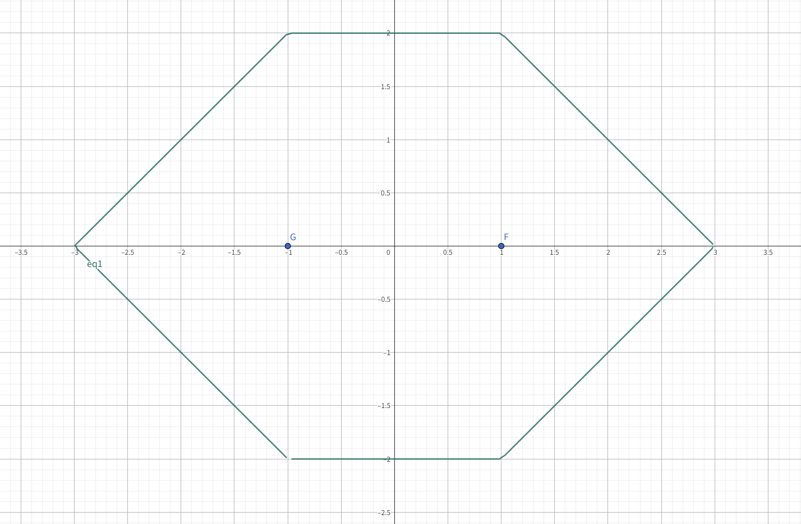

#### 几何性质

> （标准型）曼哈顿椭圆同时关于 $x,y$ 轴对称、且为中心对称图形。

**证明**：

根据标准方程 $C:|x-c|+|x+c|+2|y|=2a$。用 $-x$ 替换 $x$ 得 $C_x:|-x-c|+|-x+c|+2|y|=2a\rightarrow |x+c|+|x-c|+2|y|=2a$，等价于原方程，因此它关于 $x$ 轴对称，同时也易证它关于 $y$ 轴对称。

要证它是中心对称图形，用 $-x$ 代替 $x$、$-y$ 代替 $y$ 得 $C_O:|-x-c|+|-x+c|+2|-y|=2a\rightarrow |x+c|+|x-c|+2|y|=2a$，也等价于原方程，因此它关于原点对称。

证毕。

#### 绘图

> 曼哈顿椭圆表现为两平行线与两箭头拼接而成的封闭图形（见章头图）。两平行线均与两焦点连线平行，长度等于焦距 ${2c}$。末端为两斜线，与平行线成 ${45\degree}$ 角并相交于一点。

**证明**：

假设两焦点在 $x$ 轴上。那么标准方程为 $C:|x-c|+|x+c|+2|y|=2a$，去绝对值。

当 $x\geq c$ 时，方程化为 $C_1:x+|y|=a$。当 $y\geq0$ 时，为直线 $l_1:x+y=a$；$y<0$ 时为直线 $l_2:x-y=a$，易知 $l_1,l_2$ 相交于点 $(a,0)$，且与坐标轴成 $45\degree$ 角。

当 $0\leq x<c$ 时，方程化为 $C_2:c+|y|=a$，为直线 $l_3:y=a-c$ 和直线 $l_4:y=c-a$。易知他们平行，且同时平行于 $x$ 轴，与 $l_1,l_2$ 成 $45\degree$ 角。

根据对称性（$y$ 轴），$x<0$ 的情况同上可证。

证毕。

#### 周长 & 面积

> 曼哈顿椭圆 $C:|x-c|+|x+c|+2|y|=2a$ 的周长为 ${4}c+4\sqrt2(a-c)$；面积为 ${2}a^2-2c^2$。

**证明**：

借用上一节“绘图”的结论，可知两平行线长度共为 ${4c}$，对箭头部分求周长也很容易，为 ${4}\sqrt2(a-c)$。相加得图形周长 ${4c+4\sqrt2(a-c)}$。

先对 $x\in[-c,c]$ 部分求面积，易知为 ${2}c(2a-2c)=4ac-4c^2$；再对箭头部分求面积为 $(2a-2c)(a-c)=2a^2-4ac+2c^2$，相加得图形面积 ${2a^2-2c^2}$。

证毕。

### 绳结线

> 绳结线定义为：动点到定直线 $x=-c$ 与定点 $F(c,0)$ 的距离之积为定值 $a^2$ 的动点轨迹。方程为 $C:|x+c|\sqrt{(x-c)^2+y^2}=a^2$。

#### 绘图

> 绳结线渐进于定直线 $x=-c$，分布于 $x=-c$ 两侧。当 $a=c$ 时图形自相交于原点；$a<c$ 时图形分布在 $x<-c,-c<x<0,x>0$ 三处；$a>c$ 时图形仅分布在 $x<-c,x>-c$ 两部分。
> 
> 三种绳结线 $c=5,a\in{4,5,6}$ 的图像如下，蓝色、红色、土黄色（距直线最近、次近、最远）的曲线分别为 $a=4,a=5,a=6$ 的情况。

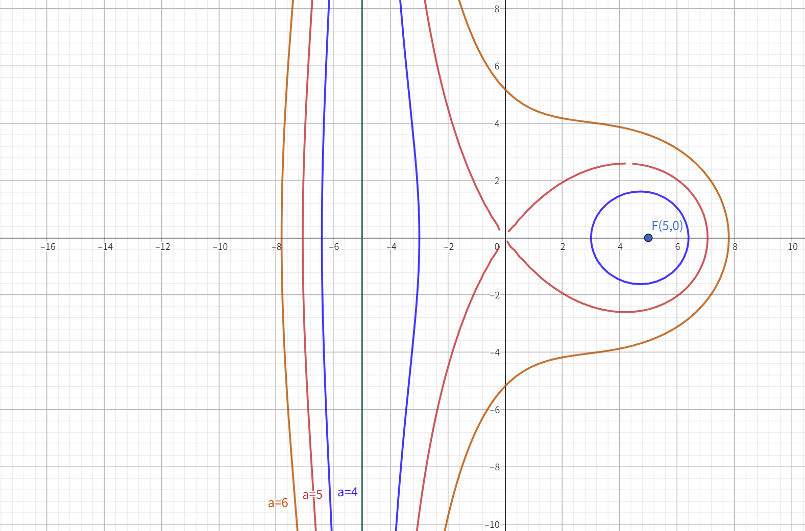

#### 顶点极值

> $a>c$ 时绳结线的左右端点分别为 $(-\sqrt{a^2+c^2},0)$ 和 $(\sqrt{a^2+c^2},0)$；$a=c$ 时三个端点从左到右分别为 $(-\sqrt{a^2+c^2},0),(0,0),(\sqrt{a^2+c^2},0)$；$a<c$ 时四个端点从左到右分别为 $(-\sqrt{a^2+c^2},0),(-\sqrt{c^2-a^2},0),(\sqrt{c^2-a^2},0),(\sqrt{a^2+c^2},0)$。

**评析**：记住亦可，但掌握计算方法为上。

**证明**：

先证明 $a\geq c$ 的情况，此时图形有两个端点，将 $y$ 赋值为 ${0}$ 得：

$$
\begin{aligned}
|x+c|\sqrt{(x-c)^2}&=a^2
\\(x+c)^2(x-c)^2&=a^4
\\(x^2-c^2)^2&=a^4
\\x^4+c^4-2c^2x^2-a^4&=0
\\x^4-2c^2x^2+c^4-a^4&=0
\end{aligned}
$$

四次方程看似解不来，但注意到方程只含四次项、二次项和常数项，那么换元 $x^2=t\geq 0$。得到方程 $t^2-2c^2t+c^4-a^4=0$，得到：

$$
t=x^2=c^2\pm a^2
$$

因此可根据 $a,c$ 的相对大小得到解的个数：当 $a<c$ 时，$t$ 的两个解都大于 ${0}$，那么 $x$ 就有四个取值，其他情况同理。

因而可得端点解集：

$$
\begin{cases}
(\pm\sqrt{a^2+c^2},0)&a>c
\\(\pm\sqrt{a^2+c^2},0)\cup(0,0)&a=c
\\(\pm\sqrt{a^2+c^2},0)\cup(\pm\sqrt{c^2-a^2},0)&a<c
\end{cases}
$$

证毕。

#### 反比例放缩

> 绳结线右半支上一点 $P(x_0,y_0)$（$x_0>-c$）满足 $y_0\leq\frac{a^2}{x_0+c}$，当且仅当 $x=c$ 时取等；若 $P$ 在左半支（$x_0<-c$），满足 $y_0<-\frac{a^2}{x+c}$，且取不到等号。

**评析**：利用不等式放缩解决，本结论来源于 2024 年新 I 卷 T11 D 选项。

**证明**：

讨论右支的情况，此时 $|x+c|=x+c$：

绳结线 $(x+c)\sqrt{(x-c)^2+y^2}=a^2$，化简方程可得 $y^2=\frac{a^4}{(x+c)^2}-(x-c)^2\leq\frac{a^4}{(x+c)^2}$，可得 $y\leq\frac{a^2}{x+c}$，当且仅当 $x=c$ 时等号成立。

讨论左支的情况，此时 $|x+c|=-x-c$：

绳结线 $(-x-c)\sqrt{(x-c)^2+y^2}=a^2$，化简方程可得 $y^2=\frac{a^4}{(x+c)^2}-(x-c)^2\leq\frac{a^4}{(x+c)^2}$，可得 $y<-\frac{a^2}{x+c}$，根据定义域 $x\neq -c$ 可知取不到等号。

证毕。

## 带旋圆锥曲线 / 非标准型圆锥曲线

### 旋转变换

> 点 $P(x,y)$ 绕原点逆时针旋转 $\theta$ 角后的新坐标为 $P_1(x\cos\theta+y\sin\theta,-x\sin\theta+y\cos\theta)$，顺时针旋转 $\theta$ 角后的新坐标为 $P_2(x\cos\theta-y\sin\theta,x\sin\theta+y\cos\theta)$。

**评析**：如果你了解线性变换的相关知识，你就会知道这其实是乘旋转矩阵得到的结果。但如果你不知道，我们可以不用线性代数知识，现场推导一番。

**证明**：

令 $P(x,y)$，假设 $OP$ 与 $x$ 轴正半轴所成角为 $\varphi$，那么 $x=|OP|\cos\varphi,y=|OP|\sin\varphi$，整理得 $\sin\varphi=\frac{y}{|OP|},\cos\varphi=\frac{x}{|OP|}$。由几何关系和旋转可得，$x_A=|OP|\cos(\varphi-\alpha),y_A=|OP|\sin(\varphi-\alpha)$。以 $x_A$ 推导为例：

$$
\begin{aligned}
x_A&=|OP|\cos(\varphi-\alpha)
\\&=|OP|(\cos\varphi\cos\alpha+\sin\varphi\sin\alpha)
\\&=|OP|\cos\varphi\cos\alpha+|OP|\sin\varphi\sin\alpha
\\&=|OP|\frac{x}{|OP|}\cos\alpha+|OP|\frac{y}{|OP|}\sin\alpha
\\&=x\cos\alpha+y\sin\alpha
\end{aligned}
$$

同理可得 $y_A=-x\sin\alpha+y\cos\alpha$，再如上算出 $B$ 点坐标，即证得成立。

证毕。

**拓展变形**：

如何将这一点运用到圆锥曲线上来呢？我们根据这个原理，联想到圆锥曲线的旋转本质上是将曲线上每一个点都做旋转变换，每个点的横纵坐标变换都满足如上规则。因此如果将圆锥曲线写成一个函数形式 $f(x,y)$，那么对应的逆时针旋转就是将函数变为 $f(x\cos\theta+y\sin\theta,-x\sin\theta+y\cos\theta)$，顺时针同理。

当然，旋转后的圆锥曲线与原圆锥曲线的形状是相同的。这意味着圆锥曲线的离心率等由其本身形状所决定的量不会发生改变，但是垂径定理、圆周定理将不再适用。

### 解平移

当某个非标准型圆锥曲线的解析式不含 $xy$ 项，却出现了 $x,y$ 这样的一次项。我们可以通过配凑完全平方式来快速知道这个圆锥曲线是如何平移得到的。

联系三角函数图像的相关知识，$f(x)=\sin2x$ 的图像过原点，而 $f\left(x+\frac{\pi}{6}\right)=\sin\left(2x+\frac{\pi}{3}\right)$ 则可看做 $f(x)$ 整体向左平移 $\frac{\pi}{6}$ 得到。类比这点，依然将变换后的圆锥曲线（以椭圆为例）看做特殊的方程 $f(x,y):\frac{x^2}{a^2}+\frac{y^2}{b^2}=1$，那么 $f(x+1,y-2):\frac{(x+1)^2}{a^2}+\frac{(y-2)^2}{b^2}=1$ 就是把这个曲线向左平移 ${1}$ 再向上平移 ${2}$ 得到。类比这点，依然将变换后的圆锥曲线（以椭圆为例）看做特殊的方程

据此，假设现在有一个方程 $9x^2+y^2+6x+2y-3=0$，这个方程的图像如何绘制？进行配凑：

$$
\begin{aligned}
9x^2+y^2+6x+2y-3&=0
\\(3x+1)^2+(y+1)^2&=5
\\\frac{(3x+1)^2}{5}+\frac{(y+1)^2}{5}&=1
\\\frac{\left(x+\frac{1}{3}\right)^2}{45}+\frac{(y+1)^2}{5}&=1
\end{aligned}
$$

易知该圆锥曲线为 $E:\frac{9x^2}{5}+\frac{y^2}{5}=1$ 向左平移 $\frac{1}{3}$，向下平移 ${1}$ 得到。

除开专门的圆锥曲线大题，圆锥曲线，尤其是非标准型的圆锥曲线，往往会在你意想不到的地方出现。例如 2024 年天津卷填空压轴：

> 若函数 $f(x)=2\sqrt{x^2-ax}-|ax-2|+1$ 恰有一个零点，则 $a$ 的取值范围为？

很多人此时会想移项平方以消去根号和绝对值，而忽略了一个东西，那就是根号项，它可以处理成一个函数图像：

$$
\begin{aligned}
\begin{aligned}
y&=\sqrt{x^2-ax}
\\y^2&=x^2-ax
\end{aligned}
\\\begin{aligned}
\\x^2-y^2+ax&=0
\\\left(x+\frac{a}{2}\right)^2-y^2&=\frac{a^2}{4}
\\\dfrac{4\left(x+\frac{a}{2}\right)^2}{a^2}-\dfrac{4y^2}{a^2}&=1
\end{aligned}
\end{aligned}
$$

它是一个平移的双曲线，并且考虑到平方根的性质，它是该双曲线在 $y\geq0$ 时的图像。此时题目变为函数图像的交点个数问题，按照去绝对值符号的方法解题即可。

### 解旋转

当某个非标准型圆锥曲线的解析式中含有 $xy$ 项，就遇到一个很棘手的问题——这个圆锥曲线是经过旋转变换得到的。联系到先前所讲的旋转变换，我们是否要把式子中 $x,y$ 全部换成一大堆带有三角函数的新式子？答案是：或许可行，但在你解出来之前考试已经结束了。此处介绍两种解旋转的方法。

#### 法一 图像性质

以方才结束的（以撰写此节的日期 2025 年 12 月 27 日为准）2025 年成都一诊多选压轴为例：

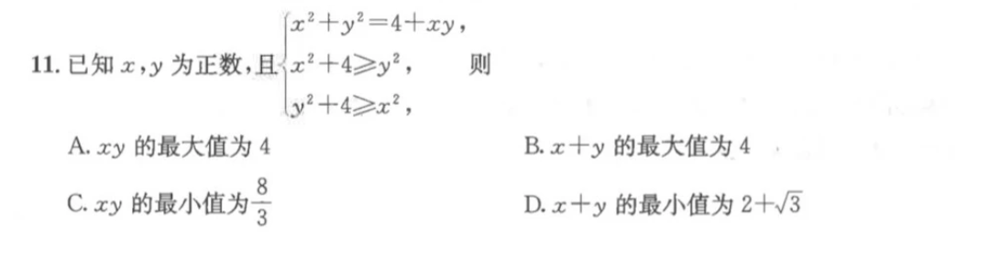

首先你需要相信出题人，要告诉自己这个（高考）是面向**全国中学生**的招生性考试，所以这个旋转变换多半是特殊的。我们仍然把第一个式子 $x^2+y^2-xy-4=0$ 看做一个方程 $f(x,y)$。这个式子不含一次项 $x,y$，我们很开心，因为这意味着 $f(y,x)$ 与 $f(x,y)$ 是等价的，运用到图像性质上来就是这个方程图像关于直线 $y=x$ 对称。做到这里这题就可以结合图像，同时运用基本不等式知识得到答案 $ABC$ 了。

假如你想知道它是由哪个曲线旋转得到，可以选择用旋转变换来把它变回标准型圆锥曲线，即用（$\theta=45\degree$） $\frac{\sqrt2}{2}x-\frac{\sqrt2}{2}y$ 代替 $x$，$\frac{\sqrt2}{2}x+\frac{\sqrt2}{2}y$ 代替 $y$ 解得 $\frac{x^2}{8}+\frac{3y^2}{8}=1$。

#### 法二 特征值

如果函数不满足 $f(x,y)=f(y,x)$ 的关系，那么恭喜你，你遇见了一个十分核蔼可氢的出题人。此时可以通过一个普适性的方法来解这个函数的旋转情况。

值得注意的是，这种非 ${45\degree}$ 的旋转基本只会出现在双曲线中。为什么呢？因为双曲线存在“渐近线”这一特殊的设定，可以免去二次曲线复杂的计算，为考生在绝望中提供一线生机。正如双曲线章节开头所说：“渐近线方程的证明几乎就是取极限值”，对于选填题可以直接代入求解。本节以保定市四校联考填空压轴为例：

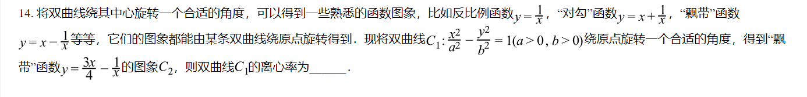

答案的做法是解出两个渐近线，首先代入 $x=+\infty$，所有分母含 $x$ 的项均看做 ${0}$，解得渐近线 $l_1:\frac{3}{4}x$；再代入 $y=+\infty$，注意到唯有 $x\rightarrow0$ 时成立，可得渐近线 $l_2:x=0$（$y$ 轴）。

根据旋转，两渐近线夹角 $\theta$ 与双曲线标准量依然满足 $\tan\frac{\theta}{2}=\frac{b}{a}$。那么解得 $\frac{b}{a}=2$，离心率 $e=\sqrt{1+\frac{b^2}{a^2}}=\sqrt5$。

接下来讲解特征值做法：

对于一般型二次曲线方程 $Ax^2+Bxy+Cy^2+Dx+Ey+F=0$，欲解其旋转情况，暂时保留重要部分：二次项和交叉项，并分离得 $Ax^2+Bxy+Cy^2=0$。构造以下二次型：

$$
xMx^T=\begin{bmatrix}
x&y
\end{bmatrix}
\begin{bmatrix}
A&\frac{B}{2}
\\\frac{B}{2}&C
\end{bmatrix}
\begin{bmatrix}
x\\y
\end{bmatrix}
$$

矩阵乘法相关运算法则[见此](https://justpureh2o.cn/articles/9306/#%E7%AC%AC%E4%BA%8C%E7%AB%A0-%E7%9F%A9%E9%98%B5%E4%B9%98%E6%B3%95)。

接下来求解 $M$ 的特征值。对于 ${2\times2}$ 矩阵，定义两个量 $\operatorname{tr}(M)=m_{11}+m_{22},\det(M)=m_{11}m_{22}-m_{12}m_{21}$（若为其他规模的矩阵则该规律不成立）。该矩阵有两个特征值 $\lambda_1,\lambda_2$，满足：

$$
\begin{cases}
\lambda_1+\lambda_2=\operatorname{tr}(M)=A+C
\\\lambda_1\lambda_2=\det(M)=\frac{B^2}{4}-AC
\end{cases}
$$

解得：

$$
\lambda=\frac{A+C\pm\sqrt{(A-C)^2+B^2}}{2}
$$

接下来任取一个特征值，例如 $\lambda_1$，让 $M$ 的主对角线元素全部减去它，得到：

$$
M^\prime=\begin{bmatrix}
A-\lambda_1&\frac{B}{2}
\\\frac{B}{2}&C-\lambda_1
\end{bmatrix}
$$

此时，$M^\prime$ 的两列/两行向量共线，合并为一个 $\vec a$。把向量换成单位向量 $\vec x^\prime,\vec y^\prime$，与标准坐标轴 $\vec x=(1,0)$ 或 $vec y=(0,1)$ 之间的夹角的余弦值就容易得到了。再用旋转变换的公式可得标准型圆锥曲线方程。

以该题为例，构造矩阵得 $M=\begin{bmatrix}\frac{3}{4}&-\frac{1}{2}\\-\frac{1}{2}&0\end{bmatrix}$，求得特征值 $\lambda_1=1,\lambda_2=-\frac{1}{4}$，用 $\lambda_1=1$ 去减，$M^\prime=\begin{bmatrix}-\frac{1}{4}&-\frac{1}{2}\\-\frac{1}{2}&-1\end{bmatrix}$。

提取，转为单位向量 $\vec a=\left(\frac{2\sqrt5}{5},\frac{\sqrt5}{5}\right)$。与 $x$ 轴夹角 $\cos\theta=\frac{2\sqrt5}{5}$。旋转回去得标准方程 $E:x^2-\frac{y^2}{2}=1$，$e=\sqrt5$。

